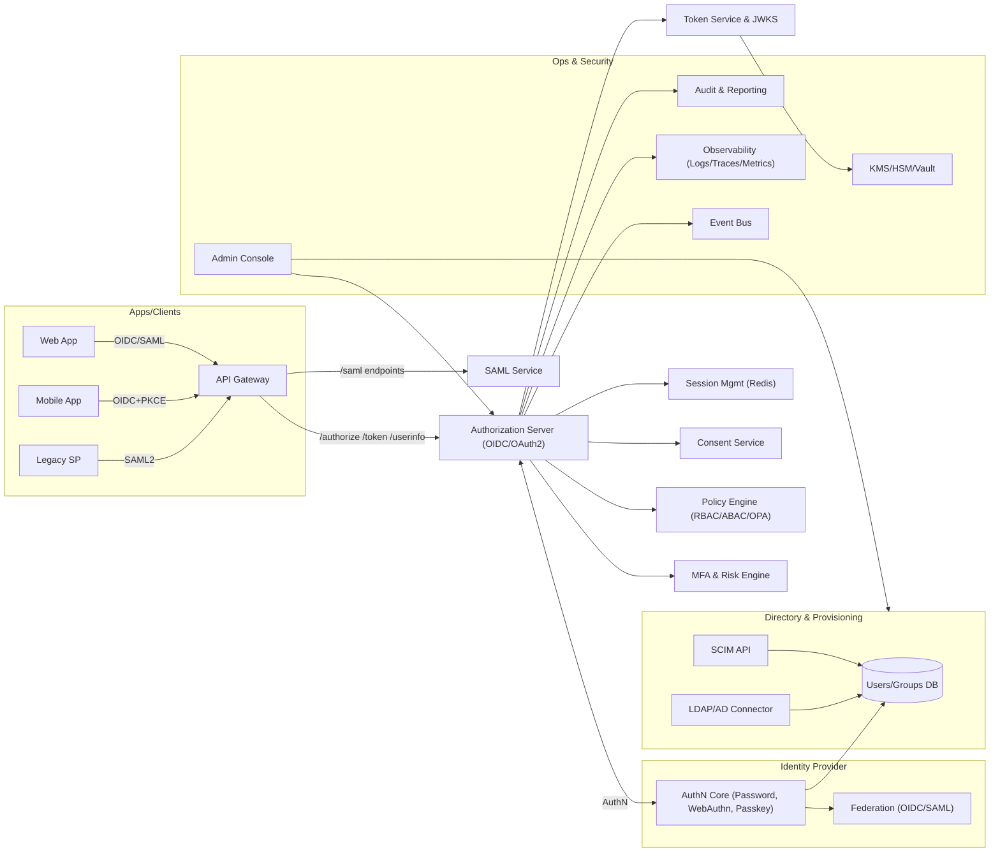
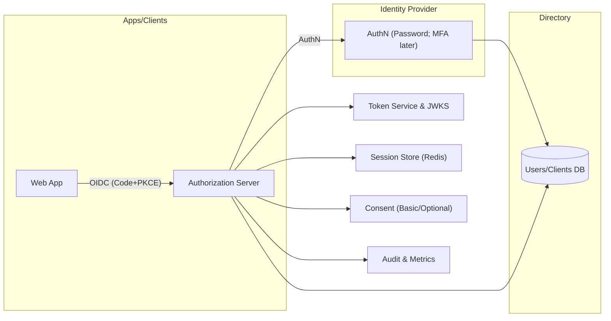

## Q: 一个sso服务，需要哪些模块？ （总体设计）

## A:
下面给你一个企业级 SSO（单点登录）服务的总体设计与模块划分。我先说明典型范围与协议假设，然后给出核心模块、关键流程、数据与部署架构、非功能性要求，以及分阶段落地路线。你可以据此挑选需要的部分深化或实现。

一、范围与协议假设
- 场景：多应用（Web、移动、API）统一认证与授权，支持企业用户目录与第三方身份联邦。
- 协议：
  - OIDC/OAuth 2.1（主推，用于现代 Web/API、移动端，Authorization Code + PKCE）
  - SAML 2.0（为兼容传统企业应用）
  - SCIM 2.0（用户与群组的自动化同步/预配）
- 令牌：JWT（RS256/ES256，支持短期 Access Token 与长期 Refresh Token），可选 PASETO
- 多租户：可选，租户级配置与密钥隔离
- 安全强化：MFA/风险引擎、密钥轮换、会话与令牌撤销

二、核心模块划分
1) 身份提供与认证（IdP/AuthN）
- 支持用户名密码、MFA（TOTP、短信、邮件、WebAuthn）、密码less（Magic Link、Passkey）
- 风险评估（设备指纹、IP/地理、失败计数、可疑行为）与自适应挑战
- 外部身份联邦（Social Login、企业 IdP：SAML/OIDC）

2) 授权服务器（OAuth2/OIDC AS）
- 流程：授权码 + PKCE、Client Credentials、Device Code、Refresh Token
- OIDC 端点：/authorize、/token、/userinfo、/.well-known/openid-configuration、/jwks
- 范围与权限：scopes、resource indicators、基于策略的细粒度权限（ABAC/RBAC）

3) 令牌服务与密钥管理
- JWT 签发/验证，Claim 模板与扩展
- JWKS 发布，密钥轮换与吊销（软/硬轮换）
- Token 黑名单/撤销、令牌内省（/introspect）、会话绑定

4) 会话管理与登出
- 浏览器会话 Cookie（HttpOnly、SameSite、Secure）、会话状态存储（Redis）
- OIDC 会话管理（front-channel/back-channel logout）
- 全局登出（终止所有应用会话与刷新令牌）

5) 用户目录与账号生命周期
- 用户、群组、角色、权限、属性（Profile）
- 外部目录集成：LDAP/AD、HR 系统；SCIM Provisioning/Deprovisioning
- 自助服务：注册、找回、重置密码、个人信息与安全设置

6) 客户端与应用注册（Relying Party/SP 管理）
- 客户端登记（client_id、密钥、重定向 URI、PKCE 策略）
- 信任关系与元数据（SAML SP metadata、OIDC 客户端元数据）
- 每应用/租户策略配置（MFA、Scopes、同意、会话时长）

7) 同意与隐私
- 同意页面与记录（scope/attribute consent）
- 隐私控制（数据最小化、Retention Policy、合规审计）

8) 管理控制台与运维工具
- 管理员控制台（租户、应用、策略、日志查询）
- 自助门户（用户安全设置、设备管理）
- 审计与报表（登录/失败、令牌使用、策略命中）

9) 安全与防护层
- 速率限制、IP 黑白名单、WAF/CDN、CSRF/CORS、防重放
- 密钥与机密管理（KMS、HSM、Vault）
- 输入校验、会话固定攻击防护、点击劫持、防越权

10) 集成与扩展
- Webhook/事件（登录成功/失败、账户变更、令牌签发）
- 可编程策略引擎（如 OPA，支持规则与上下文属性）
- SDK/适配器（前后端语言的登录与令牌验证）

11) 可观测性与平台能力
- 日志（结构化）、度量（Prometheus）、追踪（OpenTelemetry）
- 异常告警、健康检查与就绪探针
- 灰度与回滚、蓝绿/滚动发布

12) 存储与基础设施
- 数据库：PostgreSQL/MySQL（用户、客户端、策略、审计）
- 缓存：Redis（会话、验证码、限流、短期状态）
- 队列/事件总线：Kafka/NATS（审计、webhook 异步处理）
- 对象存储（头像/证书等），配置中心

三、整体架构示意
下面是一个高层架构的 Mermaid 图，帮助快速把握模块关系。

四、关键认证/授权流程
- 登录（Authorization Code + PKCE）：
  1) 客户端发起 /authorize，含 client_id、redirect_uri、scope、state、code_challenge
  2) IdP 完成用户认证（密码/MFA/风险评估），建立浏览器会话
  3) 返回授权码到 redirect_uri
  4) 客户端用 code_verifier 调 /token 换取 Access Token + ID Token + Refresh Token
  5) 客户端调用受保护 API，携带 Bearer Access Token
- 刷新令牌：
  - /token grant_type=refresh_token，策略验证（会话有效、未撤销、风险检查），更新令牌
- 令牌内省与撤销：
  - /introspect 返回令牌状态；/revoke 撤销 refresh/access，关联会话与黑名单
- 登出：
  - OIDC front-channel/back-channel，清理浏览器会话，广播 RP 端登出；撤销相关令牌与会话
- SAML 断言：
  - SP 发起或 IdP 发起；生成签名断言，回传到 ACS；会话与属性映射策略生效

五、数据模型与存储要点
- 用户：id、用户名、邮箱、状态、MFA 绑定、属性、租户
- 客户端：client_id、类型（confidential/public）、重定向 URI、密钥/公钥、允许的授权类型、Scopes
- 会话：session_id、用户、设备、风险评分、过期时间、绑定的 refresh tokens
- 令牌：jti、sub、aud、exp、scope、租户、撤销标记
- 策略：角色/权限、ABAC 规则、MFA/风控策略、同意模板
- 审计：事件类型、主体、时间、上下文、结果、追踪ID

六、部署与伸缩架构
- 无状态层（AS、SAML、API 网关）水平扩展；状态存 Redis/DB
- 数据库主从与读写分离，Redis 高可用（Sentinel/Cluster）
- 密钥管理与轮换（KMS/HSM，JWKS 发布），双密钥并存的平滑切换
- 灰度/滚动发布、灾备（跨 AZ/Region）、可观测性与告警
- 安全外层：WAF/CDN、速率限制、DDoS 防护、CORS/CSRF 策略

七、非功能性要求
- 安全：合规（GDPR、ISO27001）、最小权限、密钥保护、审计不可篡改
- 性能：登录与令牌签发低延迟，热点缓存（JWK、客户端配置）
- 可用性：99.9%+ SLA、降级策略（禁用高风险功能时保持基础登录）
- 可维护性：模块化、可测试、清晰接口与版本化端点
- 兼容性：支持现代与传统应用；SDK/文档完善
- 可扩展性：策略引擎与事件机制，插件与自定义处理钩子

八、分阶段实施路线（建议）
- Phase 1（MVP）：OIDC 授权码 + PKCE、基础认证、客户端注册、JWKS、会话、审计、Admin Console v1
- Phase 2：MFA/风险引擎、刷新令牌、登出广播、SCIM、外部 IdP、策略引擎、Observability 完整化
- Phase 3：SAML 兼容、联邦全面、密码less、租户化、报表与合规
- Phase 4：全球化部署、HSM/KMS 深度集成、企业级治理与自动化

如果你希望用 Go 来实现，我可以在你切换到 CRAFT MODE 后提供：
- 项目分层与目录结构（cmd/internal/pkg）、核心接口定义（AuthN、Token、Policy、Consent、ClientRegistry、SessionStore）
- OIDC 端点的路由与处理框架（例如 chi/gin + middleware）
- 数据模型与迁移（PostgreSQL/Redis），令牌签发与 JWKS 管理的代码样例
- 管理控制台的 API 设计与最小前端骨架

你是否倾向优先支持 OIDC（Authorization Code + PKCE）并暂时搁置 SAML？是否需要多租户与 SCIM 集成？我可以据你的偏好调整模块优先级与具体实现计划。

# Q: 简单概括就是完成 身份提供与认证 和 授权服务器  两个方向的服务呗？
# A:
是的，简单概括没错：一个可用的 SSO 核心就是两大方向的服务：
- 身份提供与认证（IdP/AuthN）：负责用户登录、MFA/风控、会话建立、外部身份联邦等
- 授权服务器（Authorization Server/OIDC）：负责标准协议端点、授权流程、令牌签发与验证

但要把这两块跑起来并稳定可用，通常还需要几个最小配套模块一起落地。给你一个精简版的“MVP 必需组件清单”，便于在现有 Go 项目里对齐实现范围。

MVP 必需组件
- AuthN 服务
  - 登录（用户名/密码），后续可扩展 MFA（TOTP/WebAuthn）
  - 风险与速率限制的基础防护
- 授权服务器（OIDC/OAuth2）
  - /authorize（Authorization Code + PKCE）
  - /token（换取 Access/ID/Refresh Token）
  - /userinfo（基于 ID Token/Access Token 返回用户信息）
  - /.well-known/openid-configuration、/jwks（元数据与公钥发布）
- 令牌服务与密钥管理
  - JWT 签发与验证（RS256/ES256）
  - JWKS 公钥集合暴露，密钥轮换机制预留
- 会话管理
  - 浏览器会话 Cookie（HttpOnly/SameSite/Secure）
  - 服务端会话状态（建议 Redis），与刷新令牌绑定
- 客户端/应用注册
  - client_id、重定向 URI、授权类型、PKCE 策略
- 用户目录（最简版）
  - 用户模型与存储（PostgreSQL/MySQL），基础属性与状态
- 同意与隐私（MVP 可先简化）
  - 基本 scope 同意页与记录（也可暂时跳过，用默认策略）
- 审计与可观测
  - 登录与发令牌事件日志（结构化），基础指标与健康检查
- 登出（MVP）
  - 清理本地会话与撤销相关刷新令牌；OIDC 前/后通道可留到下一阶段

建议的实现步骤（Phase 1）
1) 选择协议与流程：优先 OIDC 授权码 + PKCE，暂时不做 SAML
2) 数据与密钥
   - 用户表/客户端表/会话表/令牌黑名单表
   - 生成签名密钥，提供 /jwks 与 /.well-known/openid-configuration
3) 路由与端点
   - /authorize：校验 client、redirect_uri、scope、code_challenge，触发登录页
   - 登录：完成认证后建立会话，返回授权码
   - /token：code + code_verifier 换取 Access/ID/Refresh Token
   - /userinfo：返回基本用户信息
4) 会话与令牌生命周期
   - 刷新令牌 /token（grant_type=refresh_token）
   - 撤销 /revoke（Phase 2 可补）
5) 基础审计与监控
   - 结构化日志、健康检查、简单的指标埋点

简化架构示意（MVP）

如果你认可以上范围，我可以在你切回到 CRAFT MODE 后，按你项目的 Go 结构规划包与端点，例如：
- internal/authn：登录流程、密码校验、会话绑定
- internal/oidc：/authorize、/token、/userinfo、元数据
- internal/token：JWT 签发、JWKS、密钥轮换接口
- internal/session：Redis 会话与刷新令牌绑定
- internal/store：用户与客户端的存储层
- internal/audit：审计日志与指标
- cmd/server：HTTP 启动、路由注册、配置加载

你是否希望就按 OIDC 授权码 + PKCE 的 MVP 范围先落地，SAML 和更复杂的同意/风控放到下一阶段？如果是，我会给出具体的接口设计与数据模型草案供你审阅，然后再进入实现。

# Q: IdP/AuthN 分别是什么服务?简单介绍一下
# A:
下面用通俗版来区分与介绍 IdP 和 AuthN，两者常常在同一个系统里，但职责不同：

- IdP（Identity Provider，身份提供者）
  - 是“身份的权威源”。它负责管理用户账户与属性（用户名、邮箱、角色、组织、租户等），并对外以标准协议为应用“提供身份声明”（比如 OIDC 的 ID Token、SAML 断言）。
  - 常见职责：
    - 用户目录与属性管理（用户/群组/角色、资料字段）
    - 身份联邦（与外部 IdP 对接：企业 AD/LDAP、SAML/OIDC 的社交登录等）
    - 协议适配与对外发布（/.well-known/openid-configuration、JWKS、SAML 元数据）
    - 同意管理与隐私（scope/属性的开放与记录）
    - 管理控制台（应用注册、策略配置、审计查询）
  - 你可以把它理解为“对内是用户中心，对外是身份颁发者”。

- AuthN（Authentication，认证服务）
  - 是“验证这个人是谁”的具体过程和能力集合。它基于凭据和信号（密码、MFA、Passkey、设备指纹、风险评分等）来判定登录是否成功，并建立会话。
  - 常见职责：
    - 认证因子与流程：用户名/密码、TOTP、短信/邮件验证码、WebAuthn/Passkey、魔法链接等
    - 风险与策略：登录失败计数、IP/地理、设备指纹、异常行为触发二次验证
    - 会话管理：浏览器会话 Cookie、服务端状态（Redis）、登出与会话失效
    - 账号状态控制：锁定/禁用、密码重置、找回
  - 你可以把它理解为“登录引擎”，对 IdP 提供认证结果和用户主体信息。

两者的关系与边界
- AuthN 是能力层，IdP 是提供身份与对外颁发声明的产品层。很多实现里，IdP 内部会包含一个 AuthN 核心；也可以把 AuthN做成独立微服务，供授权服务器/IdP调用。
- 在 OIDC 场景下，授权服务器（AS）在处理 /authorize 时，会调用 AuthN 完成登录与会话建立；认证通过后，AS（作为 IdP 的协议面）再签发 ID Token/Access Token。
- 在 SAML 场景下，IdP 在完成 AuthN 后生成并签名 SAML 断言发给 SP。

示例端点与职责分工（简化）
- AuthN 服务
  - GET/POST /login：呈现并处理登录（含密码校验）
  - POST /mfa/verify：二次验证
  - POST /logout：销毁会话与刷新令牌绑定
- IdP/授权服务器（协议面）
  - GET /authorize：发起授权（会触发 AuthN）
  - POST /token：换取令牌（Access/ID/Refresh）
  - GET /userinfo：返回用户基本信息
  - GET /.well-known/openid-configuration、GET /jwks：发布元数据与公钥

部署建议（MVP）
- 将 AuthN 作为内部模块或独立微服务，提供标准接口（如 Authenticate、Challenge、SessionBind）
- 将 IdP/授权服务器作为对外网关与协议层，负责客户端注册、令牌签发、JWKS 与配置发布
- 共享用户目录与会话存储（DB/Redis），并通过审计模块记录登录与发令牌事件

如果你愿意，我可以基于你当前的 Go 项目结构，给出 AuthN 与 IdP/AS 的接口划分草案（例如 Go 接口与包分层），帮助你快速落地 MVP。是否需要我给出具体的接口定义和最小数据模型示例？

# Q：用实际案例举例说明什么是  IdP/AuthN/OAuth2/OIDC AS
# A：
  下面用4个真实场景来分别说明 IdP、AuthN、OAuth2、OIDC 授权服务器（AS）到底是什么，以及它们如何在实际中协同工作。

案例1：企业门户用 Keycloak 做 IdP 与 OIDC AS
- 场景：公司内部的“统一登录中心”用 Keycloak，对接多个内部 Web 系统。
- IdP：Keycloak 作为身份提供者，管理用户/角色/群组，存储用户属性，发布公钥（JWKS）与发现文档（/.well-known/openid-configuration）。
- AuthN：用户访问门户，输入用户名/密码，触发 MFA（TOTP）。Keycloak 的认证模块校验凭据与二次验证，建立浏览器会话。
- OIDC AS：门户应用走授权码 + PKCE。浏览器跳到 Keycloak 的 /authorize，认证通过后回传授权码；应用用 /token 换取 Access Token + ID Token；/userinfo 提取用户基本资料。
- 结果：门户拿到 ID Token（确认“是谁”）与 Access Token（用于后续调用受保护 API），实现单点登录与统一用户信息。

案例2：网站接入“用 Google 登录”
- 场景：你的 Web 应用提供“用 Google 登录”按钮。
- IdP：Google 是身份提供者，管理用户账户与属性。
- AuthN：用户在 Google 登录页输入密码或用 Passkey/WebAuthn，Google完成认证并建立会话。
- OIDC AS：你的应用作为 OIDC 客户端，调用 Google 的 /authorize 与 /token；最终得到 ID Token（含 sub、email 等）与 Access Token。
- OAuth2：如果你的应用还要访问 Google Drive/Gmail 等API，就用 OAuth2 的 Access Token按 scope 授权访问。
- 结果：你的应用无需自建用户系统即可识别用户身份，并按用户授权访问其 Google 资源。

案例3：微服务之间的机器到机器（M2M）访问，用 OAuth2 Client Credentials
- 场景：后端服务A需要调用服务B的受保护API，没有用户参与。
- OAuth2：服务A以“客户端”身份向授权服务器（例如 Auth0/Keycloak/你自建的AS）用 client_id+client_secret 申请 Access Token（grant_type=client_credentials）。
- Authorization Server（AS）：验证客户端凭据与允许的 scopes，签发短期 Access Token（JWT）。
- Resource Server：服务B验证 JWT（通过本地缓存的 JWKS）后允许访问。
- IdP/AuthN：此场景不涉及用户身份，AuthN不是“用户登录”，而是“客户端认证”，IdP的用户目录可缺席。
- 结果：完成纯服务间授权控制，这是 OAuth2 的典型用法，不提供用户身份声明。

案例4：旧系统接入 Azure AD（SAML）
- 场景：传统企业应用（SAML SP）要统一登录到 Azure AD。
- IdP：Azure AD 是身份提供者，掌管用户与组织信息。
- AuthN：用户在 Azure AD 登录页完成密码或MFA认证。
- 协议：Azure AD 生成并签名 SAML 断言（包含用户属性与会话信息），发回应用的 ACS（Assertion Consumer Service）。
- 结果：应用依据 SAML 断言建立本地会话，实现单点登录。这里没有 OAuth2/OIDC，但 IdP 与 AuthN仍然清晰。

角色与边界快速总结
- AuthN（认证服务）：负责“验证这个人/客户端是谁”，处理密码/MFA/风险，建立会话。可作为独立服务或 IdP 的内部模块。
- IdP（身份提供者）：管理用户目录与属性，并“对外颁发身份声明”（通过 OIDC 的 ID Token 或 SAML 断言）。
- OAuth2（授权框架）：解决“客户端如何获得访问资源的令牌”，可有人参与（授权码）或无人参与（Client Credentials）。
- OIDC AS（OIDC 的授权服务器）：在 OAuth2 之上增加“身份层”，提供 /authorize、/token、/userinfo、发现文档与 JWKS，从而既能发访问令牌，也能发布身份令牌（ID Token）。

快速对应到端点
- AuthN：/login、/mfa/verify、/logout（内部或对外）
- OIDC AS（常由 IdP实现）：/authorize、/token、/userinfo、/.well-known/openid-configuration、/jwks
- OAuth2 还包含：/token 的各类授权（authorization_code、refresh_token、client_credentials）、可选 /introspect、/revoke
- SAML（在 IdP）：/sso、/slo 及元数据发布

如果你愿意把这些映射到你的 Go 项目里，我可以给出简版接口与数据模型草案（AuthN、OIDC AS、Token、Session、ClientRegistry），并按“授权码 + PKCE”的 MVP 路线列出具体路由与处理器。是否需要我给出这份草案供你评审？