# SSO 系统开发工作清单

## 📋 项目概述

基于 Go + Gin 框架构建企业级 SSO (单点登录) 系统，支持 OAuth 2.1 / OIDC 协议，提供统一认证与授权服务。

### 🏗️ 系统架构概览

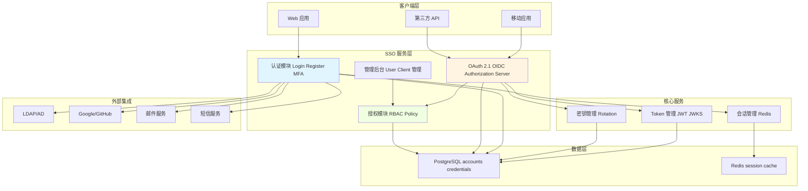

---

## 📊 开发进度总览

| 阶段 | 任务数 | 预计周期 | 状态 | 完成度 |
|------|--------|----------|------|--------|
| 阶段一：基础设施与核心框架 | 4 | 第 1-2 周 | 🔄 进行中 | 25% (1/4) |
| 阶段二：认证模块 | 4 | 第 3-4 周 | ⏳ 未开始 | 0% (0/4) |
| 阶段三：OAuth 2.1 / OIDC | 7 | 第 5-7 周 | ⏳ 未开始 | 0% (0/7) |
| 阶段四：安全与防护 | 3 | 第 8 周 | ⏳ 未开始 | 0% (0/3) |
| 阶段五：权限与策略引擎 | 2 | 第 9 周 | ⏳ 未开始 | 0% (0/2) |
| 阶段六：管理后台与 API | 4 | 第 10 周 | ⏳ 未开始 | 0% (0/4) |
| 阶段七：可观测性与运维 | 3 | 第 11 周 | ⏳ 未开始 | 0% (0/3) |
| 阶段八：高级功能 | 5 | 第 12-13 周 | ⏳ 未开始 | 0% (0/5) |
| 阶段九：测试与文档 | 5 | 第 14 周 | ⏳ 未开始 | 0% (0/5) |
| 阶段十：部署与优化 | 4 | 第 15 周 | ⏳ 未开始 | 0% (0/4) |
| **总计** | **41** | **15 周** | - | **2.4% (1/41)** |

---

## 阶段一：基础设施与核心框架 (第 1-2 周)

### ✅ 1. 项目初始化（已完成）
- [x] 基础 Gin 框架搭建
- [x] 配置管理（Viper）
- [x] 日志系统（Zap）
- [x] 数据库迁移工具
- [x] 审计日志模块

### 🔲 2. 数据库设计与账号基础模块
**知识点**: PostgreSQL、UUID、JSONB、数据库索引、密码哈希（bcrypt/argon2）、复合索引

#### 📊 数据库表结构

> **🔧 数据库设计决策说明**
> 
> 本项目在数据库设计上采用了以下关键决策：
> 
> | 决策点 | 方案 | 理由 |
> |--------|------|------|
> | **软删除** | ✅ 采用 | SSO 系统需要完整的审计追踪，删除的账号/凭证需要保留历史记录用于合规审查 |
> | **外键约束** | ❌ 不采用 | 高并发场景下外键会影响性能和扩展性，使用应用层保证数据一致性 |
> | **事务管理** | ✅ 必须 | 所有关联数据的增删改操作必须在事务中执行，保证 ACID 特性 |
> | **索引策略** | 部分索引 | 软删除字段使用条件索引 `WHERE deleted_at IS NULL`，避免索引膨胀 |

**accounts - 核心账号表**

| 字段 | 类型 | 约束 | 说明 |
|------|------|------|------|
| id | UUID | PRIMARY KEY | 账号唯一标识 |
| username | VARCHAR(50) | UNIQUE | 用户名（可选） |
| display_name | VARCHAR(100) | | 显示名称 |
| avatar_url | TEXT | | 头像 URL |
| status | VARCHAR(20) | DEFAULT 'active' | 状态：active/suspended/deleted |
| locale | VARCHAR(10) | DEFAULT 'en' | 语言偏好 |
| timezone | VARCHAR(50) | DEFAULT 'UTC' | 时区 |
| metadata | JSONB | DEFAULT '{}' | 扩展元数据 |
| created_at | TIMESTAMPTZ | DEFAULT NOW() | 创建时间 |
| updated_at | TIMESTAMPTZ | DEFAULT NOW() | 更新时间 |
| deleted_at | TIMESTAMPTZ | NULL | **软删除时间**（NULL=未删除） |

- **索引**: 
  - `username` (条件索引，WHERE username IS NOT NULL AND deleted_at IS NULL)
  - `status` (WHERE deleted_at IS NULL)
  - `deleted_at` (便于定期清理)
- **软删除策略**: 使用 `deleted_at` 字段标记删除，保留数据用于审计和恢复
- **外键策略**: 不使用数据库外键，通过应用层保证引用完整性（性能优先）
- **说明**: 仅存储账号身份信息，不包含认证凭证

---

**account_credentials - 认证凭证表**

| 字段 | 类型 | 约束 | 说明 |
|------|------|------|------|
| id | UUID | PRIMARY KEY | 凭证唯一标识 |
| account_id | UUID | NOT NULL | 关联账号（应用层外键） |
| credential_type | VARCHAR(20) | NOT NULL | 凭证类型 |
| identifier | VARCHAR(255) | | 凭证标识符（邮箱/手机号等） |
| credential_value | TEXT | | 凭证值（密码 hash/TOTP secret） |
| verified | BOOLEAN | DEFAULT false | 是否已验证 |
| primary_credential | BOOLEAN | DEFAULT false | 是否为主要凭证 |
| metadata | JSONB | DEFAULT '{}' | 扩展信息 |
| created_at | TIMESTAMPTZ | DEFAULT NOW() | 创建时间 |
| verified_at | TIMESTAMPTZ | | 验证时间 |
| last_used_at | TIMESTAMPTZ | | 最后使用时间 |
| deleted_at | TIMESTAMPTZ | NULL | **软删除时间** |

- **credential_type 枚举**: `password`, `email`, `phone`, `totp`, `webauthn`, `backup_code`
- **复合唯一索引**: `(credential_type, identifier)` WHERE deleted_at IS NULL
- **索引**: 
  - `account_id` WHERE deleted_at IS NULL
  - `(credential_type, verified)` WHERE deleted_at IS NULL
  - `deleted_at` (便于清理)
- **软删除策略**: 删除凭证时保留历史记录，便于安全审计
- **级联删除**: 账号软删除时，应用层软删除所有关联凭证
- **说明**: 支持一个账号多个凭证，灵活扩展认证方式

---

**federated_identities - 第三方身份关联表**

| 字段 | 类型 | 约束 | 说明 |
|------|------|------|------|
| id | UUID | PRIMARY KEY | 唯一标识 |
| account_id | UUID | NOT NULL | 关联账号（应用层外键） |
| provider | VARCHAR(50) | NOT NULL | 身份提供商 |
| provider_user_id | VARCHAR(255) | NOT NULL | 提供商用户 ID |
| profile | JSONB | DEFAULT '{}' | 用户资料 |
| created_at | TIMESTAMPTZ | DEFAULT NOW() | 创建时间 |
| deleted_at | TIMESTAMPTZ | NULL | **软删除时间** |

- **唯一索引**: `(provider, provider_user_id)` WHERE deleted_at IS NULL
- **索引**: `account_id` WHERE deleted_at IS NULL
- **软删除策略**: 解绑第三方账号时软删除，保留绑定历史
- **说明**: 管理 Google、GitHub、微信等第三方登录

---

**其他关联表**

| 表名 | 字段 | 软删除 | 说明 |
|------|------|--------|------|
| groups | id, name, description, parent_id, metadata, created_at, updated_at, **deleted_at** | ✅ | 群组表（支持树形结构） |
| roles | id, name (UNIQUE), description, permissions (JSONB), metadata, created_at, updated_at, **deleted_at** | ✅ | 角色表 |
| account_roles | account_id, role_id, created_at, **deleted_at** | ✅ | 账号-角色关联（复合主键：account_id + role_id + deleted_at） |
| account_groups | account_id, group_id, created_at, **deleted_at** | ✅ | 账号-群组关联（复合主键：account_id + group_id + deleted_at） |
#### ✅ 实施任务清单

- [ ] 编写数据库迁移脚本 `db/migrations/0002_accounts.up.sql`
  - 包含所有表定义、索引、**不含外键约束**
  - 添加软删除字段 `deleted_at`
  - 创建条件索引（过滤 deleted_at IS NULL）
- [ ] 创建账号领域模型 `internal/account/domain/account.go`
  - Account 结构体
  - Credential 结构体
  - FederatedIdentity 结构体
- [ ] 实现账号仓储接口 `internal/account/repository/account_repository.go`
  - `FindByID`, `FindByUsername`, `FindByCredential`
  - `CreateAccount`, `UpdateAccount`, `SoftDeleteAccount`
  - `AddCredential`, `VerifyCredential`, `RemoveCredential`
  - `LinkFederatedIdentity`, `UnlinkFederatedIdentity`
  - **所有修改操作必须支持事务传递**

#### 🔄 事务处理策略

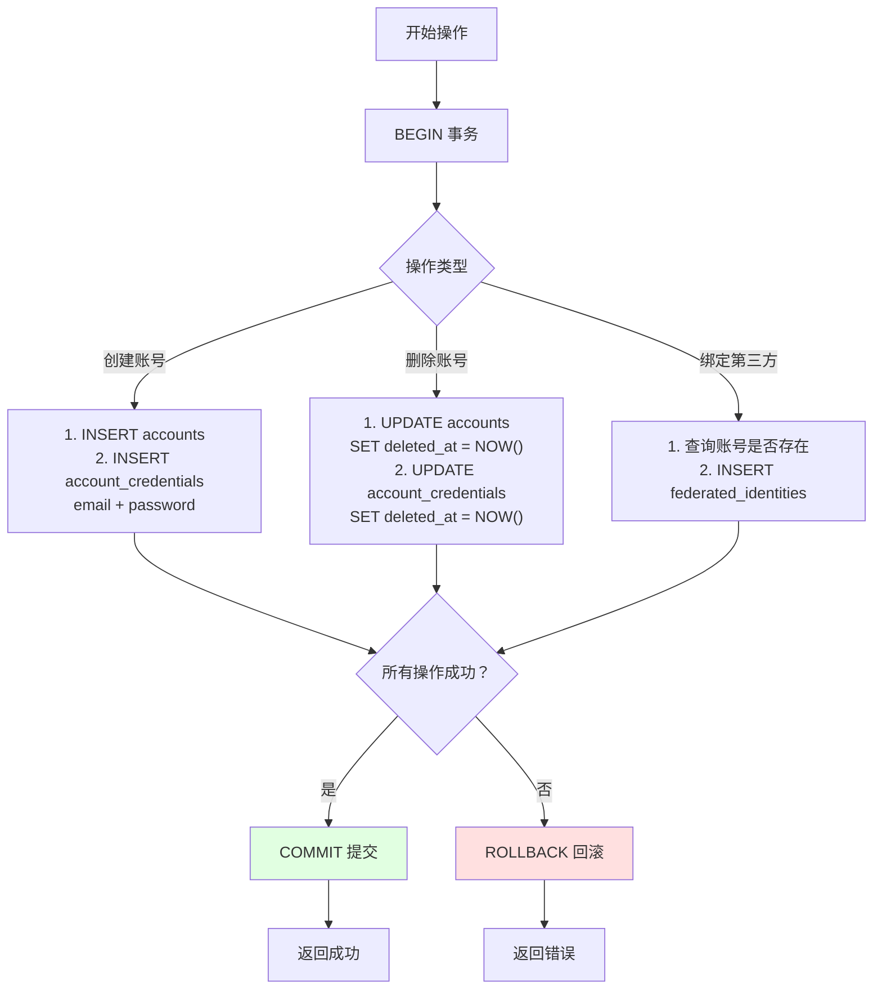

**必须使用事务的场景：**

1. **账号注册** - 同时创建 account + credentials
2. **账号删除** - 软删除 account + 关联的所有 credentials
3. **凭证更换** - 删除旧凭证 + 添加新凭证（如换绑手机号）
4. **角色分配** - 批量添加/删除角色关联
5. **第三方绑定** - 创建 account（如不存在）+ 创建 federated_identity

**代码示例：**

```go
// 示例 1：账号注册（事务完整实现）
func (r *AccountRepository) CreateAccount(ctx context.Context, account *Account, credentials []*Credential) error {
    // 开始事务，设置隔离级别
    tx, err := r.db.BeginTx(ctx, &sql.TxOptions{
        Isolation: sql.LevelReadCommitted,
    })
    if err != nil {
        return fmt.Errorf("begin transaction: %w", err)
    }
    defer tx.Rollback() // 确保异常时回滚
    
    // 1. 插入账号
    query := `INSERT INTO accounts (id, username, display_name, created_at, updated_at) 
              VALUES ($1, $2, $3, NOW(), NOW())`
    if _, err := tx.ExecContext(ctx, query, account.ID, account.Username, account.DisplayName); err != nil {
        return fmt.Errorf("insert account: %w", err)
    }
    
    // 2. 插入凭证（email/password）
    credQuery := `INSERT INTO account_credentials 
                  (id, account_id, credential_type, identifier, credential_value, verified, created_at) 
                  VALUES ($1, $2, $3, $4, $5, $6, NOW())`
    for _, cred := range credentials {
        cred.ID = uuid.New().String()
        cred.AccountID = account.ID
        if _, err := tx.ExecContext(ctx, credQuery, 
            cred.ID, cred.AccountID, cred.Type, cred.Identifier, cred.Value, cred.Verified); err != nil {
            return fmt.Errorf("insert credential %s: %w", cred.Type, err)
        }
    }
    
    // 提交事务
    if err := tx.Commit(); err != nil {
        return fmt.Errorf("commit transaction: %w", err)
    }
    
    return nil
}

// 示例 2：账号软删除（正确的分层架构）

// ========== Repository 层（internal/account/repository/account_repository.go） ==========
type AccountRepository interface {
    // 软删除账号（带事务）
    SoftDeleteAccount(ctx context.Context, tx *sql.Tx, accountID string, deletedAt time.Time) error
    // 软删除账号的所有凭证
    SoftDeleteCredentialsByAccount(ctx context.Context, tx *sql.Tx, accountID string, deletedAt time.Time) error
    // 软删除账号的角色关联
    SoftDeleteRolesByAccount(ctx context.Context, tx *sql.Tx, accountID string, deletedAt time.Time) error
    // 软删除账号的第三方身份
    SoftDeleteFederatedIdentitiesByAccount(ctx context.Context, tx *sql.Tx, accountID string, deletedAt time.Time) error
}

type accountRepositoryImpl struct {
    db *sql.DB
}

func (r *accountRepositoryImpl) SoftDeleteAccount(ctx context.Context, tx *sql.Tx, accountID string, deletedAt time.Time) error {
    query := `UPDATE accounts SET deleted_at = $1, updated_at = $1 
              WHERE id = $2 AND deleted_at IS NULL`
    _, err := tx.ExecContext(ctx, query, deletedAt, accountID)
    return err
}

func (r *accountRepositoryImpl) SoftDeleteCredentialsByAccount(ctx context.Context, tx *sql.Tx, accountID string, deletedAt time.Time) error {
    query := `UPDATE account_credentials SET deleted_at = $1 
              WHERE account_id = $2 AND deleted_at IS NULL`
    _, err := tx.ExecContext(ctx, query, deletedAt, accountID)
    return err
}

func (r *accountRepositoryImpl) SoftDeleteRolesByAccount(ctx context.Context, tx *sql.Tx, accountID string, deletedAt time.Time) error {
    query := `UPDATE account_roles SET deleted_at = $1 
              WHERE account_id = $2 AND deleted_at IS NULL`
    _, err := tx.ExecContext(ctx, query, deletedAt, accountID)
    return err
}

func (r *accountRepositoryImpl) SoftDeleteFederatedIdentitiesByAccount(ctx context.Context, tx *sql.Tx, accountID string, deletedAt time.Time) error {
    query := `UPDATE federated_identities SET deleted_at = $1 
              WHERE account_id = $2 AND deleted_at IS NULL`
    _, err := tx.ExecContext(ctx, query, deletedAt, accountID)
    return err
}

// ========== Token Repository 层 ==========
type TokenRepository interface {
    RevokeTokensByAccount(ctx context.Context, tx *sql.Tx, accountID string, revokedAt time.Time, reason string) error
}

func (r *tokenRepositoryImpl) RevokeTokensByAccount(ctx context.Context, tx *sql.Tx, accountID string, revokedAt time.Time, reason string) error {
    query := `UPDATE oauth2_tokens 
              SET revoked_at = $1, revoke_reason = $2 
              WHERE account_id = $3 AND revoked_at IS NULL`
    _, err := tx.ExecContext(ctx, query, revokedAt, reason, accountID)
    return err
}

// ========== Service 层（internal/account/service/account_service.go） ==========
type AccountService struct {
    accountRepo AccountRepository
    tokenRepo   TokenRepository
    db          *sql.DB
}

// Service 层职责：业务逻辑编排、事务管理、业务验证
func (s *AccountService) SoftDeleteAccount(ctx context.Context, accountID string) error {
    // 1. 业务前置验证（可选）
    // - 检查账号是否存在
    // - 检查是否有权限删除
    // - 记录审计日志
    
    // 2. 开始事务，协调多个 Repository 操作
    tx, err := s.db.BeginTx(ctx, &sql.TxOptions{
        Isolation: sql.LevelReadCommitted,
    })
    if err != nil {
        return fmt.Errorf("开始事务失败: %w", err)
    }
    defer tx.Rollback() // 确保异常时回滚
    
    now := time.Now()
    
    // 3. 调用 Repository 方法，而不是直接执行 SQL
    if err := s.accountRepo.SoftDeleteAccount(ctx, tx, accountID, now); err != nil {
        return fmt.Errorf("软删除账号失败: %w", err)
    }
    
    if err := s.accountRepo.SoftDeleteCredentialsByAccount(ctx, tx, accountID, now); err != nil {
        return fmt.Errorf("软删除凭证失败: %w", err)
    }
    
    if err := s.accountRepo.SoftDeleteRolesByAccount(ctx, tx, accountID, now); err != nil {
        return fmt.Errorf("软删除角色关联失败: %w", err)
    }
    
    if err := s.accountRepo.SoftDeleteFederatedIdentitiesByAccount(ctx, tx, accountID, now); err != nil {
        return fmt.Errorf("软删除第三方身份失败: %w", err)
    }
    
    if err := s.tokenRepo.RevokeTokensByAccount(ctx, tx, accountID, now, "account_deleted"); err != nil {
        return fmt.Errorf("撤销 Token 失败: %w", err)
    }
    
    // 4. 提交事务
    if err := tx.Commit(); err != nil {
        return fmt.Errorf("提交事务失败: %w", err)
    }
    
    // 5. 业务后置处理（事务外操作）
    // - 清除 Redis 缓存
    // - 发送通知（邮件/Webhook）
    // - 记录审计日志
    
    return nil
}

// 示例 3：事务辅助方法（可复用）
type DB struct {
    *sql.DB
}

func (db *DB) WithTransaction(ctx context.Context, fn func(*sql.Tx) error) error {
    tx, err := db.BeginTx(ctx, &sql.TxOptions{
        Isolation: sql.LevelReadCommitted,
    })
    if err != nil {
        return err
    }
    
    defer func() {
        if p := recover(); p != nil {
            tx.Rollback()
            panic(p) // 重新抛出 panic
        }
    }()
    
    if err := fn(tx); err != nil {
        tx.Rollback()
        return err
    }
    
    return tx.Commit()
}
```

#### 📊 ER 关系图

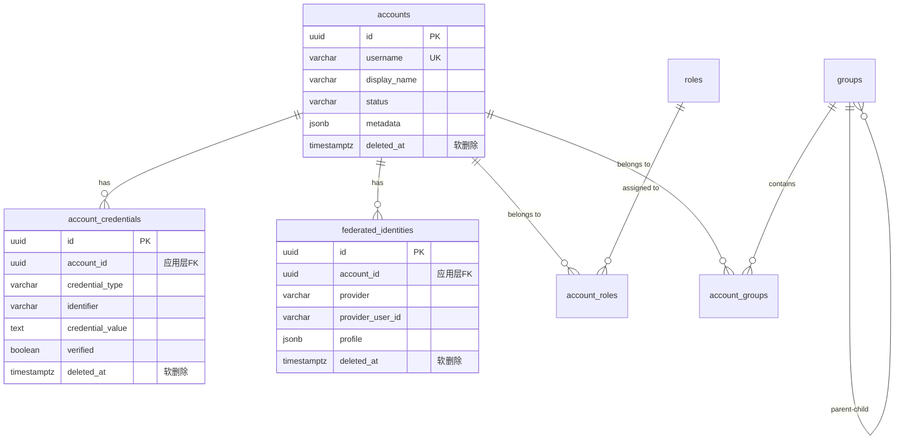

---

#### 🔍 软删除 vs 硬删除对比

| 维度 | 软删除（本项目采用） | 硬删除 |
|------|---------------------|--------|
| **数据恢复** | ✅ 可恢复（UPDATE deleted_at = NULL） | ❌ 无法恢复 |
| **审计追踪** | ✅ 完整保留操作历史 | ❌ 记录永久丢失 |
| **合规要求** | ✅ 满足 GDPR "被遗忘权"（可后期物理删除） | ⚠️ 难以追溯 |
| **查询性能** | ⚠️ 需要 WHERE deleted_at IS NULL | ✅ 无额外过滤 |
| **存储空间** | ⚠️ 数据不断增长 | ✅ 空间节省 |
| **唯一约束** | ⚠️ 需要条件唯一索引 | ✅ 简单唯一索引 |
| **SSO 场景适用性** | ✅ **强烈推荐** | ❌ 不推荐 |

**软删除实施要点：**

1. **查询时默认过滤**：所有 SELECT 都加 `WHERE deleted_at IS NULL`
2. **唯一索引调整**：使用条件唯一索引 `WHERE deleted_at IS NULL`
3. **定期清理**：软删除超过 1 年的数据可物理删除（满足数据保留政策）
4. **管理接口**：提供"恢复已删除账号"功能

#### 📋 关联表软删除策略

**核心原则**: 所有表都使用软删除，包括关联表

| 表类型 | 示例 | 软删除策略 | 说明 |
|--------|------|-----------|------|
| **主表** | accounts, oauth2_clients | ✅ 必须 | 核心业务实体 |
| **凭证表** | account_credentials | ✅ 必须 | 与主表同步软删除 |
| **关联表** | account_roles, account_groups | ✅ 推荐 | 保留历史关联关系 |
| **元数据表** | oauth2_tokens, authorization_codes | ✅ 推荐 | 用于审计追溯 |
| **日志表** | audit_logs | ❌ 不需要 | 日志本身已是历史记录 |

**关联表唯一性约束处理：**

```sql
-- 方案 A：复合唯一索引 + deleted_at（推荐）
-- 允许同一关联多次创建和删除
CREATE UNIQUE INDEX idx_account_roles_unique 
ON account_roles(account_id, role_id, COALESCE(deleted_at, '1970-01-01'));

-- 方案 B：条件唯一索引（仅约束未删除数据）
CREATE UNIQUE INDEX idx_account_roles_unique 
ON account_roles(account_id, role_id) 
WHERE deleted_at IS NULL;
```

---

#### 🔗 外键约束 vs 应用层约束对比

| 维度 | 数据库外键 | 应用层约束（本项目采用） |
|------|-----------|-------------------------|
| **数据一致性** | ✅ 数据库强制保证 | ⚠️ 需应用层逻辑保证 |
| **性能影响** | ❌ 锁等待、死锁风险 | ✅ 无额外锁开销 |
| **水平扩展** | ❌ 跨库分片困难 | ✅ 易于分库分表 |
| **灵活性** | ❌ 模式变更困难 | ✅ 灵活调整关联逻辑 |
| **开发复杂度** | ✅ 简单 | ⚠️ 需手动维护 |
| **故障隔离** | ❌ 级联失败风险 | ✅ 单表故障不影响其他表 |
| **高并发场景** | ❌ 锁竞争严重 | ✅ **推荐** |

**不使用外键的实施要点：**

1. **应用层检查**：删除账号前查询关联数据
   ```go
   // 删除前检查
   hasTokens := repo.HasActiveTokens(accountID)
   if hasTokens {
       return errors.New("账号有活跃 Token，无法删除")
   }
   ```

2. **事务保证一致性**：使用数据库事务确保原子性（见上面的事务处理策略）

3. **定期数据校验**：后台任务检测孤儿记录
   ```sql
   -- 查找孤儿凭证（账号已删除但凭证未删除）
   SELECT * FROM account_credentials 
   WHERE account_id NOT IN (
       SELECT id FROM accounts WHERE deleted_at IS NULL
   ) AND deleted_at IS NULL;
   ```

4. **监控告警**：发现数据不一致时及时告警

---

#### ⚡ 性能优化建议

**1. 条件索引（Partial Index）**
```sql
-- 仅索引未删除的数据，减少索引大小 50%+
CREATE INDEX idx_accounts_username 
ON accounts(username) 
WHERE deleted_at IS NULL;

CREATE UNIQUE INDEX idx_credentials_email 
ON account_credentials(credential_type, identifier) 
WHERE deleted_at IS NULL AND credential_type = 'email';
```

**2. 定期归档**
```sql
-- 每月归档软删除超过 1 年的数据到归档表
INSERT INTO accounts_archive 
SELECT * FROM accounts 
WHERE deleted_at < NOW() - INTERVAL '1 year';

DELETE FROM accounts 
WHERE deleted_at < NOW() - INTERVAL '1 year';
```

**3. 查询优化 - 使用统一的查询基类**
```go
// 定义查询基类，自动添加软删除过滤
type BaseRepository struct {
    db *sql.DB
}

func (r *BaseRepository) buildQuery(base string) string {
    return base + " AND deleted_at IS NULL"
}

// 使用示例
query := r.buildQuery("SELECT * FROM accounts WHERE id = ?")
```

---

**参考文档**:
- PostgreSQL 官方文档
- Go database/sql 包
- jackc/pgx 驱动文档

---

### 🔲 3. Redis 缓存与会话存储
**知识点**: Redis、Session 管理、TTL、键设计模式

#### 🗂️ Redis 键设计规范

| 用途 | Key 模式 | Value 类型 | TTL | 示例 |
|------|----------|-----------|-----|------|
| 会话存储 | `session:{id}` | Hash | 24h | `session:abc123` → {account_id, created_at} |
| 验证码 | `captcha:{id}` | String | 5min | `captcha:xyz789` → "A3F8" |
| 登录失败计数 | `login:fail:{ip}` | String | 15min | `login:fail:192.168.1.1` → "3" |
| 权限缓存 | `perms:{account_id}` | Set | 5min | `perms:user-123` → ["accounts.read", "logs.read"] |
| Token 黑名单 | `blacklist:token:{jti}` | String | token_exp | `blacklist:token:abc` → "revoked" |
| OAuth2 State | `oauth2:state:{state}` | Hash | 10min | `oauth2:state:xyz` → {client_id, redirect_uri} |
| TOTP 防重放 | `totp:used:{account_id}:{code}` | String | 90s | `totp:used:user-123:123456` → "1" |
| 速率限制 | `ratelimit:{ip}:{endpoint}` | String | 1min | `ratelimit:1.2.3.4:login` → "5" |

#### 📊 会话数据结构示例

```json
{
  "session:550e8400-e29b-41d4-a716-446655440000": {
    "account_id": "550e8400-e29b-41d4-a716-446655440000",
    "username": "zhangsan",
    "ip": "192.168.1.100",
    "user_agent": "Mozilla/5.0...",
    "created_at": "2024-12-31T10:00:00Z",
    "last_active": "2024-12-31T10:30:00Z",
    "mfa_verified": true
  }
}
```

#### ✅ 实施任务清单

- [ ] 配置 Redis 连接池（已有配置，需实现连接层）
- [ ] 实现 Redis 客户端封装（internal/cache/redis_client.go）
- [ ] 实现会话存储服务（internal/session/service/session_service.go）
  - 会话创建、读取、更新、删除
  - 会话 TTL 管理
- [ ] 实现验证码缓存服务（internal/captcha/service/captcha_service.go）
  - 验证码生成与验证
  - 防重放攻击
- [ ] 实现 Token 黑名单服务（internal/token/service/blacklist_service.go）

**参考文档**:
- Redis 官方文档
- go-redis/redis 库文档

---

### 🔲 4. 密钥管理与 JWKS
**知识点**: RSA/ECDSA、JWT、JWKS、密钥轮换、PEM 格式

#### 🔑 密钥生命周期

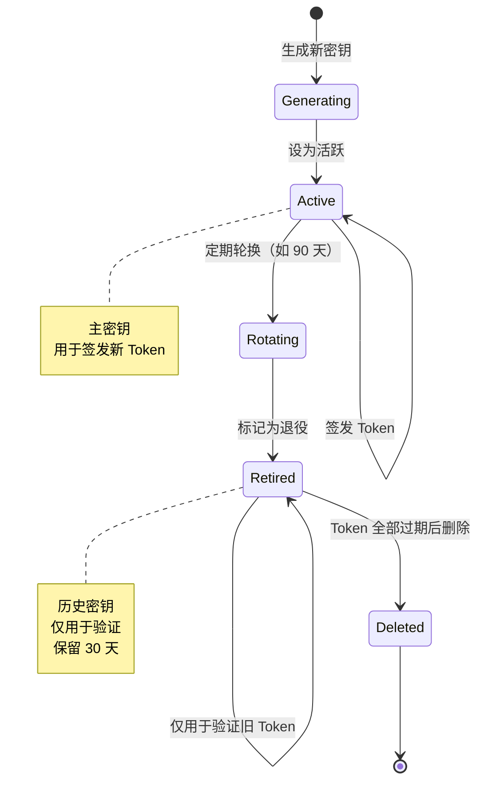

#### 📊 数据表设计

**crypto_keys - 密钥表**

| 字段 | 类型 | 约束 | 说明 |
|------|------|------|------|
| id | UUID | PRIMARY KEY | 密钥唯一标识 |
| kid | VARCHAR(50) | UNIQUE | Key ID（用于 JWKS） |
| algorithm | VARCHAR(10) | NOT NULL | 算法：RS256/RS512/ES256 |
| public_key | TEXT | NOT NULL | 公钥（PEM 格式） |
| private_key | TEXT | NOT NULL | 私钥（加密存储，PEM 格式） |
| status | VARCHAR(20) | DEFAULT 'active' | 状态：active/retired/deleted |
| created_at | TIMESTAMPTZ | DEFAULT NOW() | 创建时间 |
| rotated_at | TIMESTAMPTZ | | 轮换时间 |

#### 🌐 JWKS 端点响应示例

```json
{
  "keys": [
    {
      "kty": "RSA",
      "use": "sig",
      "kid": "2024-12-key-1",
      "alg": "RS256",
      "n": "0vx7agoebGcQ...",
      "e": "AQAB"
    },
    {
      "kty": "RSA",
      "use": "sig",
      "kid": "2024-09-key-1",
      "alg": "RS256",
      "n": "xjlCRBqkl9X...",
      "e": "AQAB"
    }
  ]
}
```

#### ✅ 实施任务清单

- [ ] 编写数据库迁移脚本 `db/migrations/0003_crypto_keys.up.sql`
- [ ] 编写数据库迁移脚本 `db/migrations/0003_crypto_keys.up.sql`
- [ ] 实现密钥生成工具 `internal/crypto/keygen.go`
  - RSA-2048/4096 密钥生成
  - ES256 密钥生成
- [ ] 实现密钥管理服务 `internal/crypto/service/key_service.go`
  - 密钥创建、存储、轮换
  - 密钥状态管理（active/retired）
- [ ] 实现 JWKS 端点 `router/oidc.go`
  - `GET /.well-known/jwks.json`
  - 返回公钥集合（包含 active 和 retired 状态的密钥）
- [ ] 实现密钥轮换定时任务 `internal/crypto/task/key_rotation.go`
  - 每 90 天自动轮换
  - 保留旧密钥 30 天用于验证

**参考文档**:
- RFC 7517 (JSON Web Key)
- RFC 7518 (JWA)
- golang-jwt/jwt 库

---

## 阶段二：认证模块 (第 3-4 周)

### 🔲 5. 账号注册与密码管理
**知识点**: 密码强度验证、邮箱验证、手机验证、SMTP、bcrypt

#### 📝 账号注册流程

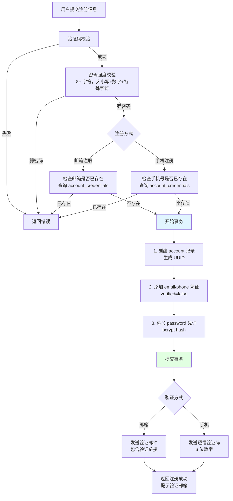

#### 🔐 邮箱验证流程

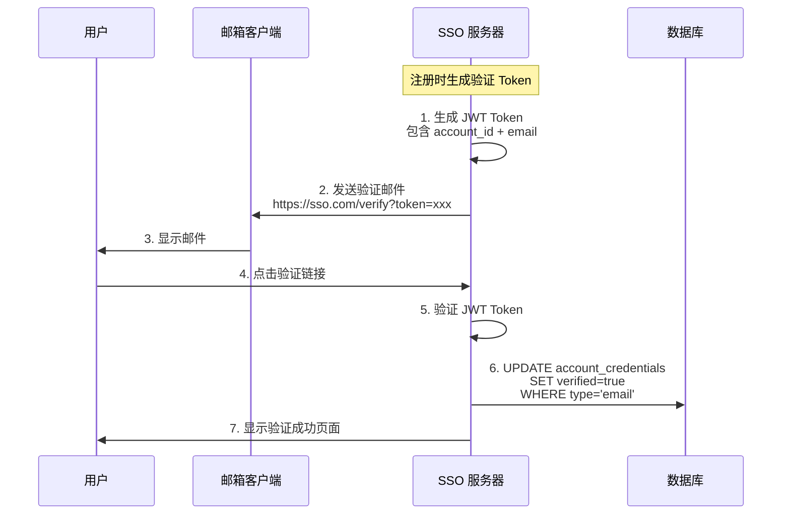

#### ✅ 实施任务清单

- [ ] 实现账号注册 API（internal/authn/handler/register_handler.go）
  - POST /api/v1/auth/register
  - 创建 account 记录
  - 添加 email/phone 凭证到 account_credentials
  - 添加 password 凭证（bcrypt hash）
  - 密码强度校验（8+ 字符，大小写+数字+特殊字符）
  - 验证码验证
- [ ] 实现邮箱验证服务（internal/authn/service/email_verification.go）
  - 发送验证邮件（包含验证链接）
  - 验证 Token 校验（JWT 或 随机 Token）
  - 更新 account_credentials.verified = true
- [ ] 实现手机验证服务（internal/authn/service/phone_verification.go）
  - 短信验证码发送（接入阿里云/腾讯云 SMS）
  - 验证码校验（6 位数字，5 分钟有效）
  - 更新 account_credentials.verified = true
- [ ] 实现密码重置功能
  - POST /api/v1/auth/password/reset/request（请求重置）
    - 通过 email/phone 凭证查找账号
    - 发送重置链接/验证码
  - POST /api/v1/auth/password/reset/confirm（确认重置）
    - 验证 Token/验证码
    - 更新 password 凭证的 credential_value
- [ ] 实现密码修改功能
  - POST /api/v1/auth/password/change（已登录账号修改密码）
    - 验证旧密码
    - 更新 password 凭证

**参考文档**:
- OWASP 密码强度指南
- SMTP 协议
- 阿里云短信服务 SDK / 腾讯云短信 SDK

---

### 🔲 6. 本地登录与会话管理
**知识点**: Cookie、HttpOnly、SameSite、CSRF、会话固定攻击、凭证查询

#### 🔐 登录认证流程

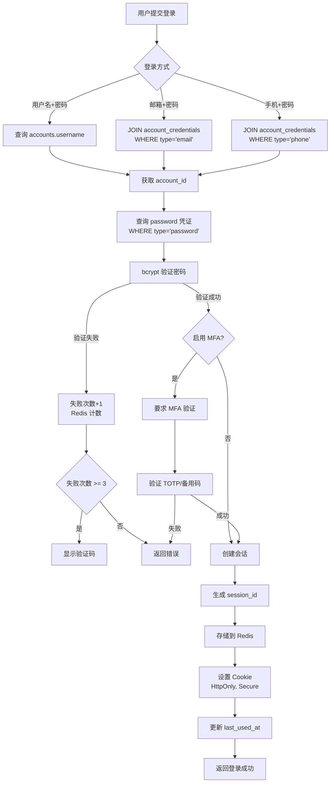

#### ✅ 实施任务清单

- [ ] 实现账号登录 API（internal/authn/handler/login_handler.go）
  - POST /api/v1/auth/login
  - 支持多种登录方式：
    - 用户名 + 密码：通过 username 查找账号
    - 邮箱 + 密码：通过 email 凭证查找账号
    - 手机号 + 密码：通过 phone 凭证查找账号
  - 查询逻辑：JOIN account_credentials 表，验证 verified = true
  - 密码验证：从 password 类型凭证获取 credential_value，bcrypt 比对
  - 验证码校验（可选，登录失败 3 次后强制）
  - 登录失败次数限制（防暴力破解，Redis 计数）
  - 更新 account_credentials.last_used_at
- [ ] 实现会话创建与 Cookie 设置
  - HttpOnly, Secure, SameSite=Lax
  - 会话 ID 生成（UUID v4）
  - Redis 存储会话数据（key: session:{id}, value: account_id + metadata）
  - TTL 设置（默认 24 小时）
- [ ] 实现登录中间件（middleware/auth_middleware.go）
  - 从 Cookie 读取 session_id
  - Redis 验证会话有效性
  - 加载账号信息到 Context
  - 刷新会话过期时间（滑动窗口）
- [ ] 实现登出 API
  - POST /api/v1/auth/logout
  - 清除会话 Cookie（Max-Age=-1）
  - 删除 Redis 会话
- [ ] 实现"记住我"功能
  - 长期会话 Token（7/30 天）
  - 独立的 remember_token 存储（account_credentials 表，新类型）
  - 设备指纹绑定（存储在 credential_value）

**参考文档**:
- OWASP Session Management Cheat Sheet
- MDN Web Docs - HTTP Cookies

---

### 🔲 7. 多因素认证（MFA）
**知识点**: TOTP、HOTP、RFC 6238、QR Code、备用码

#### 🔐 MFA 启用流程

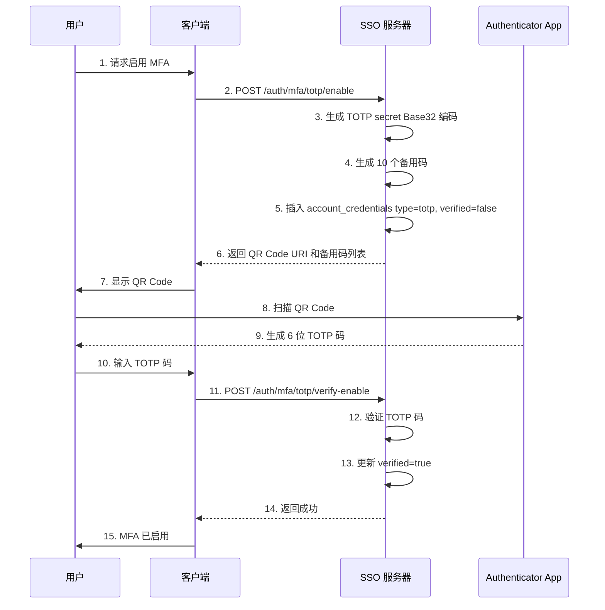

#### 🔐 MFA 验证流程

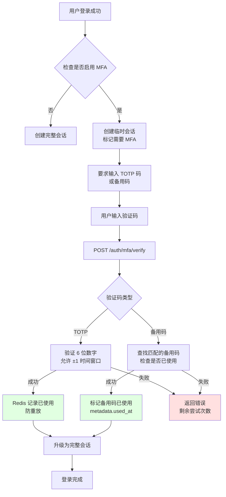

#### 📊 凭证表设计（复用 account_credentials）

| credential_type | identifier | credential_value | metadata | 说明 |
|----------------|------------|------------------|----------|------|
| `totp` | NULL | Base32 编码的 secret | `{"qr_uri": "otpauth://..."}` | TOTP 密钥 |
| `backup_code` | 备用码明文 | bcrypt hash | `{"used_at": "2024-12-31T10:00:00Z"}` | 备用码（10 条记录） |

#### ✅ 实施任务清单
- [ ] 实现 TOTP 服务（internal/mfa/service/totp_service.go）
  - 生成 TOTP 密钥（32 字节随机数，Base32 编码）
  - 生成 QR Code URI（otpauth://totp/SSO:user@example.com?secret=...&issuer=SSO）
  - 验证 TOTP 码（6 位数字，允许 ±1 时间窗口容错）
  - 防重放攻击（Redis 记录已使用的 TOTP 码）
- [ ] 实现 MFA 启用 API
  - POST /api/v1/auth/mfa/totp/enable
    - 生成 TOTP secret
    - 插入 account_credentials 记录（verified=false）
    - 返回 QR Code 和备用码（10 个随机码）
  - POST /api/v1/auth/mfa/totp/verify-enable
    - 验证用户输入的 TOTP 码
    - 更新 verified=true，enabled=true
- [ ] 实现 MFA 验证 API
  - POST /api/v1/auth/mfa/verify
    - 登录流程集成：密码验证通过后，检查是否启用 MFA
    - 验证 TOTP 码或备用码
    - MFA 验证通过后创建完整会话
- [ ] 实现备用码管理
  - 生成备用码：10 个 8 位随机字符串
  - 使用后标记（metadata 记录使用时间）
  - 重新生成：POST /api/v1/auth/mfa/backup-codes/regenerate

**参考文档**:
- RFC 6238 (TOTP)
- pquerna/otp 库文档
- Google Authenticator 协议

---

### 🔲 8. 第三方登录（Social Login）
**知识点**: OAuth 2.0、OpenID Connect、授权码流程、Redirect URI

#### 🔄 第三方登录流程

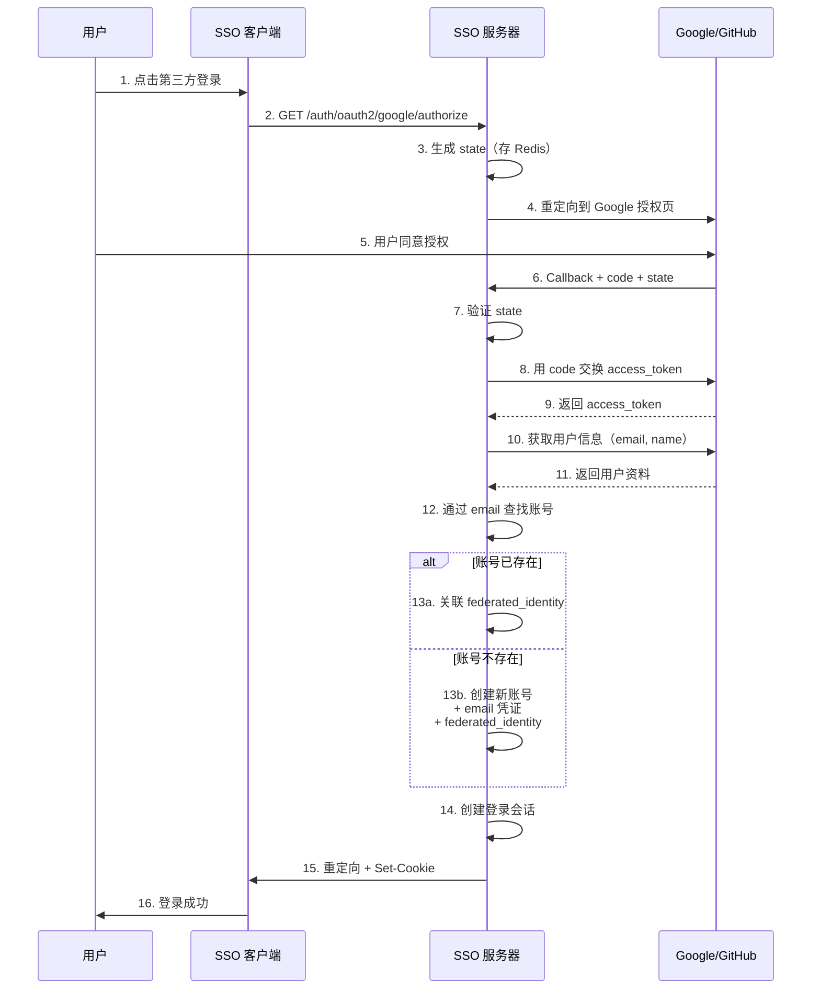

#### 📊 数据表设计

**identity_providers - 身份提供商配置表**

| 字段 | 类型 | 说明 |
|------|------|------|
| id | UUID | 唯一标识 |
| name | VARCHAR(100) | 提供商名称 |
| type | VARCHAR(50) | 类型：google/github/wechat |
| client_id | VARCHAR(255) | OAuth2 Client ID |
| client_secret | TEXT | OAuth2 Client Secret（加密存储） |
| config | JSONB | 额外配置（授权 URL、Token URL 等） |
| enabled | BOOLEAN | 是否启用 |
| created_at | TIMESTAMPTZ | 创建时间 |

#### ✅ 实施任务清单
- [ ] 实现 OAuth2 客户端封装（internal/federation/oauth2_client.go）
  - 授权 URL 生成（构建 state 参数，Redis 临时存储）
  - Token 交换（authorization_code -> access_token）
  - 用户信息获取（调用第三方 UserInfo 端点）
- [ ] 实现 Google OAuth2 登录
  - GET /api/v1/auth/oauth2/google/authorize
    - 重定向到 Google 授权页面
  - GET /api/v1/auth/oauth2/google/callback
    - 接收 code，交换 token
    - 获取 Google 用户信息（email, name, picture）
    - 查找或创建账号：
      - 通过 email 凭证查找现有账号
      - 不存在则创建新账号 + email 凭证
      - 插入 federated_identities 记录
    - 创建登录会话
- [ ] 实现 GitHub OAuth2 登录
  - GET /api/v1/auth/oauth2/github/authorize
  - GET /api/v1/auth/oauth2/github/callback
    - 类似 Google 流程，使用 GitHub API
- [ ] 实现账号关联/解绑功能
  - POST /api/v1/user/federated-identities/link
    - 已登录账号绑定第三方身份
    - 检查第三方身份是否已被其他账号使用
  - DELETE /api/v1/user/federated-identities/{provider}
    - 解绑第三方身份
    - 至少保留一种登录方式（email/phone 或 password）

**参考文档**:
- OAuth 2.0 RFC 6749
- Google Identity Platform
- GitHub OAuth Apps
- golang.org/x/oauth2 库

---

## 阶段三：OAuth 2.1 / OIDC 授权服务器 (第 5-7 周)

### 🔲 9. 客户端（Relying Party）管理
**知识点**: OAuth 2.0 Client Types、Redirect URI 验证、Client Credentials

#### 📊 数据表设计

**oauth2_clients - OAuth2 客户端表**

| 字段 | 类型 | 约束 | 说明 |
|------|------|------|------|
| id | UUID | PRIMARY KEY | 唯一标识 |
| client_id | VARCHAR(255) | UNIQUE | 客户端 ID（公开） |
| client_secret_hash | TEXT | | 客户端密钥（bcrypt hash） |
| name | VARCHAR(100) | NOT NULL | 客户端名称 |
| description | TEXT | | 客户端描述 |
| type | VARCHAR(20) | NOT NULL | 类型：public/confidential |
| logo_url | TEXT | | Logo URL |
| redirect_uris | JSONB | DEFAULT '[]' | 允许的回调地址列表 |
| allowed_scopes | JSONB | DEFAULT '[]' | 允许的 Scopes |
| grant_types | JSONB | DEFAULT '["authorization_code"]' | 允许的授权类型 |
| token_endpoint_auth_method | VARCHAR(50) | DEFAULT 'client_secret_basic' | Token 端点认证方式 |
| pkce_required | BOOLEAN | DEFAULT true | 是否强制 PKCE |
| owner_id | UUID | | 客户端所有者账号 ID（应用层外键） |
| metadata | JSONB | DEFAULT '{}' | 扩展元数据 |
| created_at | TIMESTAMPTZ | DEFAULT NOW() | 创建时间 |
| updated_at | TIMESTAMPTZ | DEFAULT NOW() | 更新时间 |
| deleted_at | TIMESTAMPTZ | NULL | **软删除时间** |

- **type 枚举**: 
  - `public` - 公开客户端（如前端 SPA、移动应用），无法安全存储密钥，必须使用 PKCE
  - `confidential` - 机密客户端（如后端服务），可以安全存储密钥
- **grant_types 可选值**: `["authorization_code", "refresh_token", "client_credentials"]`
- **索引**:
  - `client_id` (唯一索引，WHERE deleted_at IS NULL)
  - `owner_id` (WHERE deleted_at IS NULL)
- **软删除策略**: 删除客户端时保留历史记录，撤销所有关联 Token
- **说明**: OAuth 2.1 推荐所有客户端使用 PKCE，包括机密客户端

#### ✅ 实施任务清单

- [ ] 编写数据库迁移脚本 `db/migrations/0006_oauth2_clients.up.sql`
- [ ] 实现客户端管理 API `internal/oauth2/handler/client_handler.go`
  - POST /api/v1/oauth2/clients（创建客户端）
  - GET /api/v1/oauth2/clients/{client_id}（查询客户端）
  - PUT /api/v1/oauth2/clients/{client_id}（更新客户端）
  - DELETE /api/v1/oauth2/clients/{client_id}（软删除客户端）
- [ ] 实现客户端认证服务 `internal/oauth2/service/client_auth_service.go`
  - client_secret_basic（HTTP Basic 认证）
  - client_secret_post（POST 参数认证）
  - Redirect URI 验证（精确匹配，防劫持）

**参考文档**:
- OAuth 2.1 Draft
- RFC 6749 Section 2

---

### 🔲 10. 授权码流程（Authorization Code + PKCE）
**知识点**: PKCE、code_challenge、code_verifier、S256/plain

#### 🔐 OAuth 2.1 授权码流程（带 PKCE）

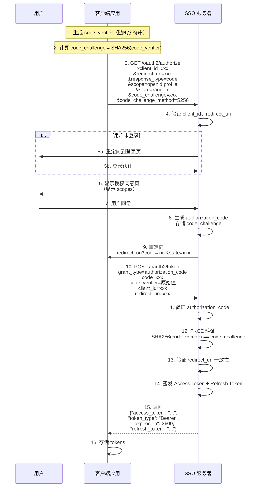

#### 📊 数据表设计

**authorization_codes - 授权码表**

| 字段 | 类型 | 约束 | 说明 |
|------|------|------|------|
| code | VARCHAR(255) | PRIMARY KEY | 授权码（唯一，32 字节随机数 Base64URL） |
| client_id | VARCHAR(255) | NOT NULL | 客户端 ID（应用层外键） |
| account_id | UUID | NOT NULL | 授权的账号（应用层外键） |
| redirect_uri | TEXT | NOT NULL | 回调地址（必须与 Token 请求一致） |
| scopes | JSONB | DEFAULT '[]' | 授权范围 |
| code_challenge | VARCHAR(255) | | PKCE 挑战码（Base64URL 编码） |
| code_challenge_method | VARCHAR(10) | | S256 或 plain（推荐 S256） |
| nonce | VARCHAR(255) | | OIDC nonce（防重放） |
| state | VARCHAR(255) | | 客户端状态参数 |
| expires_at | TIMESTAMPTZ | NOT NULL | 过期时间（创建后 5 分钟） |
| used_at | TIMESTAMPTZ | | 使用时间（标记已使用，防重复） |
| created_at | TIMESTAMPTZ | DEFAULT NOW() | 创建时间 |

- **索引**:
  - `code` (主键)
  - `(client_id, account_id, used_at)` (复合索引，查询未使用的授权码)
  - `expires_at` (便于清理过期记录)
- **生命周期**: 5 分钟有效期，一次性使用
- **安全措施**: 
  - 授权码使用后立即标记 `used_at`
  - 如果检测到重复使用，撤销该授权码关联的所有 Token（防盗用）
  - 定期清理过期授权码（保留 24 小时用于审计）
- **说明**: 不使用外键，避免高并发场景下的锁竞争

#### ✅ 实施任务清单

- [ ] 编写数据库迁移脚本 `db/migrations/0007_authorization_codes.up.sql`
- [ ] 实现授权端点 `internal/oauth2/handler/authorize_handler.go`
  - `GET/POST /oauth2/authorize`
  - 参数验证：client_id, redirect_uri, response_type, scope, state, code_challenge, code_challenge_method, nonce
  - 检查账号登录状态（从 session 读取 account_id）
  - 未登录：跳转到登录页面（保存请求参数到 session）
  - 已登录：跳转到授权同意页面
- [ ] 实现授权同意页面（前端）
  - 显示客户端信息（名称、Logo、描述）
  - 显示请求的 Scopes（翻译为易懂的权限描述）
  - 用户同意/拒绝按钮
- [ ] 实现授权码生成与存储
  - 生成唯一授权码（32 字节随机数，Base64URL 编码）
  - 关联 PKCE 参数（code_challenge, code_challenge_method）
  - 存储到 authorization_codes 表（expires_at: 5 分钟后）
  - 重定向到 `redirect_uri?code=...&state=...`
- [ ] 实现 Token 端点 `internal/oauth2/handler/token_handler.go`
  - `POST /oauth2/token`
  - `grant_type=authorization_code`
  - 验证授权码（未过期、未使用）
  - **PKCE 验证**：计算 SHA256(code_verifier) 并 Base64URL 编码后与 code_challenge 比对
  - 验证 client_id、redirect_uri 一致性
  - 签发 Access Token 和 Refresh Token（调用任务 11 的 JWT 服务）
  - 标记授权码已使用（used_at）

**参考文档**:
- RFC 7636 (PKCE)
- OAuth 2.1 Draft
- OWASP OAuth 2.0 Security Best Practices

---

### 🔲 11. JWT Access Token 签发与验证
**知识点**: JWT、Claims、iss、sub、aud、exp、nbf、iat

#### 📊 数据表设计

**oauth2_tokens - Token 元数据表**

| 字段 | 类型 | 约束 | 说明 |
|------|------|------|------|
| id | UUID | PRIMARY KEY | 唯一标识 |
| jti | VARCHAR(255) | UNIQUE | JWT ID（Token 唯一标识符） |
| account_id | UUID | NOT NULL | 关联账号（应用层外键） |
| client_id | VARCHAR(255) | NOT NULL | 关联客户端（应用层外键） |
| token_type | VARCHAR(20) | NOT NULL | 类型：access/refresh |
| scopes | JSONB | DEFAULT '[]' | 授权范围 |
| token_family_id | UUID | | Token 家族 ID（用于 Refresh Token 轮换检测） |
| parent_jti | VARCHAR(255) | | 父 Token JTI（Refresh Token 轮换追踪） |
| expires_at | TIMESTAMPTZ | NOT NULL | 过期时间 |
| revoked_at | TIMESTAMPTZ | | 撤销时间 |
| revoke_reason | VARCHAR(100) | | 撤销原因：user_request/admin/security/rotation |
| created_at | TIMESTAMPTZ | DEFAULT NOW() | 创建时间 |
| last_used_at | TIMESTAMPTZ | | 最后使用时间（可选追踪） |
| deleted_at | TIMESTAMPTZ | NULL | **软删除时间** |

- **索引**:
  - `jti` (唯一索引，WHERE deleted_at IS NULL)
  - `(account_id, token_type)` (WHERE deleted_at IS NULL AND revoked_at IS NULL)
  - `(client_id, token_type)` (WHERE deleted_at IS NULL)
  - `(token_family_id, revoked_at)` (用于检测盗用)
  - `expires_at` (便于清理过期 Token)
- **生命周期**:
  - Access Token: 1 小时（短期，无需存储也可通过 JWT 自包含验证）
  - Refresh Token: 7-30 天（长期，必须存储）
- **软删除策略**: Token 过期后保留 30 天用于审计，之后物理删除
- **Token Family**: 用于 Refresh Token 轮换时检测盗用攻击
  - 同一授权流程的所有 Refresh Token 共享 `token_family_id`
  - 如果检测到已撤销的 Refresh Token 被使用，撤销整个家族

#### ✅ 实施任务清单

- [ ] 编写数据库迁移脚本 `db/migrations/0008_oauth2_tokens.up.sql`
- [ ] 实现 JWT 签发服务 `internal/token/service/jwt_service.go`
  - 签名算法：RS256/ES256（从 crypto_keys 表加载私钥）
  - Claims 构建：
    - 标准 Claims：iss, sub（account_id）, aud（client_id）, exp, iat, nbf, jti
    - 自定义 Claims：scope（空格分隔字符串）
    - 用户信息 Claims（可选）：email, name, roles
  - 插入 oauth2_tokens 记录
- [ ] 实现 JWT 验证服务
  - 签名验证（从 JWKS 获取公钥）
  - 过期时间验证（exp）
  - Issuer/Audience 验证
  - 黑名单检查（查询 oauth2_tokens.revoked_at）
- [ ] 实现 Token 内省端点
  - POST /oauth2/introspect
  - RFC 7662 标准
  - 返回 Token 元数据（active, scope, exp, sub, client_id 等）
  - 支持客户端认证

**参考文档**:
- RFC 7519 (JWT)
- RFC 9068 (JWT Profile for OAuth 2.0 Access Tokens)
- golang-jwt/jwt 库

---

### 🔲 12. Refresh Token 与令牌轮换
**知识点**: Refresh Token、Token Rotation、Token Family

#### 🔄 Refresh Token 轮换机制

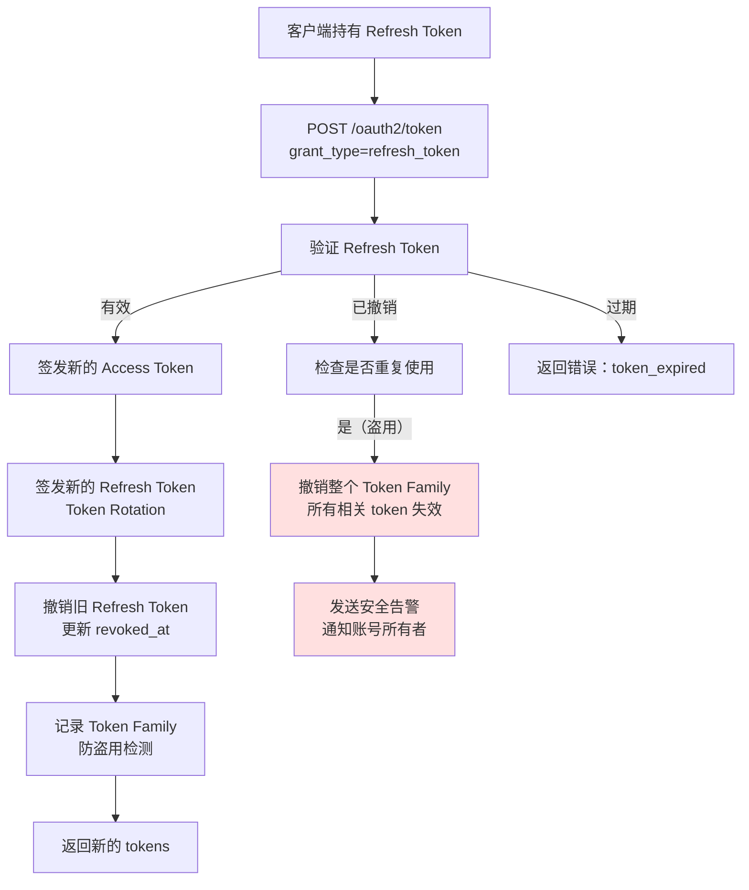

#### 📊 Token Family 追踪示例

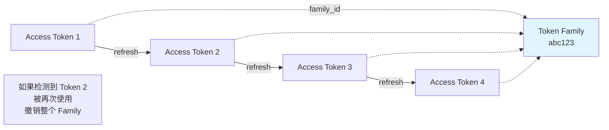

#### ✅ 实施任务清单

- [ ] 实现 Refresh Token 签发
  - 长期有效（7-30 天）
  - 存储在数据库（可撤销）
  - 关联 Access Token（Token Family）
- [ ] 实现 Refresh Token 端点
  - POST /oauth2/token
  - grant_type=refresh_token
  - 验证 Refresh Token 有效性
  - 签发新的 Access Token 和 Refresh Token（轮换）
  - 撤销旧的 Refresh Token
- [ ] 实现 Refresh Token 撤销
  - 检测重复使用（防盗用）
  - 撤销整个 Token Family

**参考文档**:
- RFC 6749 Section 6
- OAuth 2.0 Threat Model

---

### 🔲 13. Client Credentials Grant
**知识点**: Service-to-Service 认证、机器身份

- [ ] 实现 Client Credentials 端点
  - POST /oauth2/token
  - grant_type=client_credentials
  - 客户端认证（client_secret_basic/post）
  - 签发 Access Token（无 user context）
  - Scope 限制

**参考文档**:
- RFC 6749 Section 4.4

---

### 🔲 14. OIDC 核心功能
**知识点**: ID Token、UserInfo、Discovery、OIDC Scopes

#### 🆔 OIDC 架构概览

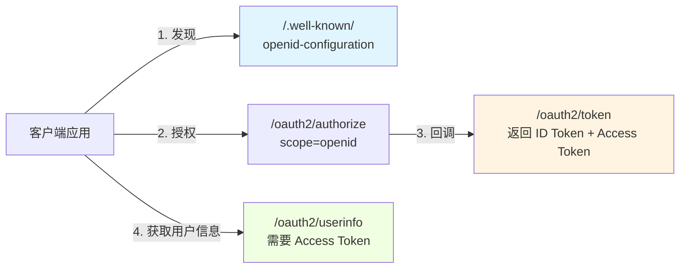

#### 📊 OIDC Scopes 映射表

| Scope | 返回的 Claims | 数据来源 | 查询逻辑 |
|-------|---------------|----------|---------|
| `openid` | sub（必须） | accounts.id | 直接返回 account_id |
| `profile` | name, family_name, given_name, picture, locale, timezone | accounts.display_name, avatar_url, locale, timezone | 直接从 accounts 表读取 |
| `email` | email, email_verified | account_credentials (type='email') | 查询 `primary_credential=true` 或最早的 email 凭证 |
| `phone` | phone_number, phone_number_verified | account_credentials (type='phone') | 查询 `primary_credential=true` 或最早的 phone 凭证 |
| `address` | address | accounts.metadata | JSON 路径：`metadata->>'address'` |

#### 🔍 多凭证场景处理规则

**问题**: 一个账号可能有多个 email/phone 凭证，应该返回哪一个？

**解决方案**:

```sql
-- 优先级 1：主要凭证（primary_credential = true）
SELECT identifier, verified 
FROM account_credentials 
WHERE account_id = ? 
  AND credential_type = 'email' 
  AND deleted_at IS NULL 
  AND primary_credential = true
LIMIT 1;

-- 优先级 2：如果没有主要凭证，返回最早创建的已验证凭证
SELECT identifier, verified 
FROM account_credentials 
WHERE account_id = ? 
  AND credential_type = 'email' 
  AND deleted_at IS NULL 
  AND verified = true
ORDER BY created_at ASC
LIMIT 1;

-- 优先级 3：如果都未验证，返回最早创建的凭证
SELECT identifier, verified 
FROM account_credentials 
WHERE account_id = ? 
  AND credential_type = 'email' 
  AND deleted_at IS NULL 
ORDER BY created_at ASC
LIMIT 1;
```

**建议**: 在账号管理 API 中提供"设置主要邮箱/手机号"功能，更新 `primary_credential` 字段。

#### 🎫 ID Token 结构示例

```json
{
  "iss": "https://sso.example.com",
  "sub": "550e8400-e29b-41d4-a716-446655440000",
  "aud": "client-app-123",
  "exp": 1735689600,
  "iat": 1735686000,
  "auth_time": 1735686000,
  "nonce": "random-nonce-value",
  "name": "张三",
  "email": "zhangsan@example.com",
  "email_verified": true,
  "picture": "https://cdn.example.com/avatar.jpg"
}
```

#### ✅ 实施任务清单

- [ ] 实现 OpenID Configuration 端点
  - GET /.well-known/openid-configuration
  - 返回 OIDC 元数据（issuer, endpoints, supported algorithms, scopes, claims 等）
- [ ] 实现 ID Token 签发
  - 授权码流程中返回 id_token（在 Token 端点响应中）
  - Claims：
    - 标准 Claims：iss, sub（account_id）, aud, exp, iat, nonce, auth_time
    - 用户信息 Claims（根据 scope）：name, email, picture 等
  - 签名算法：RS256（与 Access Token 共用密钥）
- [ ] 实现 UserInfo 端点
  - GET /oauth2/userinfo
  - 验证 Access Token（从 Authorization Header）
  - 从 accounts 表和 account_credentials 表加载用户信息
  - 返回用户信息（根据 Token 的 Scopes 过滤）
- [ ] 实现 OIDC Scopes 映射
  - openid: 必须（标记为 OIDC 请求）
  - profile: name, family_name, given_name, picture, locale, timezone
  - email: email（从 account_credentials 查询 email 凭证的 identifier）, email_verified（verified 字段）
  - phone: phone_number（从 account_credentials 查询 phone 凭证）, phone_number_verified
  - address: address（从 accounts.metadata 读取）

**参考文档**:
- OpenID Connect Core 1.0
- OIDC Discovery Specification

---

### 🔲 15. OIDC 会话管理与登出
**知识点**: RP-Initiated Logout、Front-Channel Logout、Back-Channel Logout

- [ ] 设计会话表（oidc_sessions）
  - 字段：session_id, account_id, client_id, id_token_hint, created_at, expires_at
  - 索引：session_id（唯一），account_id
  - 说明：记录 OIDC 会话，用于登出管理
- [ ] 编写数据库迁移脚本（db/migrations/0009_oidc_sessions.up.sql）
- [ ] 实现 RP-Initiated Logout
  - GET /oauth2/logout
  - 参数：id_token_hint, post_logout_redirect_uri, state
  - 验证 id_token_hint（可选）
  - 清除 SSO 会话（Redis session）
  - 删除 oidc_sessions 记录
  - 撤销相关 Token（更新 oauth2_tokens.revoked_at）
  - 重定向到 post_logout_redirect_uri?state=...
- [ ] 实现 Front-Channel Logout
  - 客户端注册 frontchannel_logout_uri（存储在 oauth2_clients 表）
  - 登出时生成包含 iframe 的 HTML 页面
  - 每个 iframe 加载客户端的 logout_uri（触发客户端清除本地 session）
- [ ] 实现 Back-Channel Logout（可选）
  - 客户端注册 backchannel_logout_uri
  - 登出时 POST 请求到客户端 logout_uri
  - 发送 logout_token (JWT)，包含 sid（session ID）和 sub（account_id）
  - 异步处理（队列或 Goroutine）

**参考文档**:
- OIDC Session Management
- OIDC Front-Channel Logout
- OIDC Back-Channel Logout

---

## 阶段四：安全与防护 (第 8 周)

### 🔲 16. 速率限制与防护
**知识点**: Rate Limiting、滑动窗口、令牌桶算法

- [ ] 实现细粒度速率限制（internal/security/ratelimit/rate_limiter.go）
  - 登录端点：5 次/分钟/IP
  - 注册端点：3 次/小时/IP
  - Token 端点：20 次/分钟/client_id
  - 基于 Redis 的分布式限流
- [ ] 实现 IP 黑白名单
  - 管理后台配置
  - 中间件拦截
- [ ] 实现防暴力破解
  - 登录失败次数统计（Redis）
  - 账号临时锁定（15 分钟）
  - 验证码强制显示

**参考文档**:
- go-redis/redis_rate 库
- OWASP Rate Limiting

---

### 🔲 17. CSRF 与 CORS 防护
**知识点**: CSRF Token、Same-Site Cookie、CORS Preflight

- [ ] 实现 CSRF 中间件（middleware/csrf_middleware.go）
  - 生成 CSRF Token
  - 验证 CSRF Token
  - 存储在 Session 或 Cookie
- [ ] 实现 CORS 中间件（middleware/cors_middleware.go）
  - 允许的 Origin 配置
  - Preflight 请求处理
  - Credentials 支持
- [ ] 实现 Clickjacking 防护
  - X-Frame-Options: DENY/SAMEORIGIN
  - Content-Security-Policy: frame-ancestors

**参考文档**:
- OWASP CSRF Prevention Cheat Sheet
- MDN CORS

---

### 🔲 18. 输入校验与安全加固
**知识点**: XSS、SQL Injection、参数化查询

- [ ] 实现输入校验中间件
  - 参数类型验证
  - 长度限制
  - 正则表达式验证（邮箱、手机号等）
- [ ] 实现 XSS 防护
  - HTML 转义
  - Content-Security-Policy Header
- [ ] SQL 注入防护（已有参数化查询）
  - 代码审计
  - 使用 ORM 或 sqlx
- [ ] 实现请求防重放
  - Nonce 验证（一次性令牌）
  - 时间戳验证

**参考文档**:
- OWASP Top 10
- Go validator/v10 库

---

## 阶段五：权限与策略引擎 (第 9 周)

### 🔲 19. RBAC 权限模型
**知识点**: RBAC、ABAC、权限继承、资源权限

#### 🔐 RBAC 权限检查流程

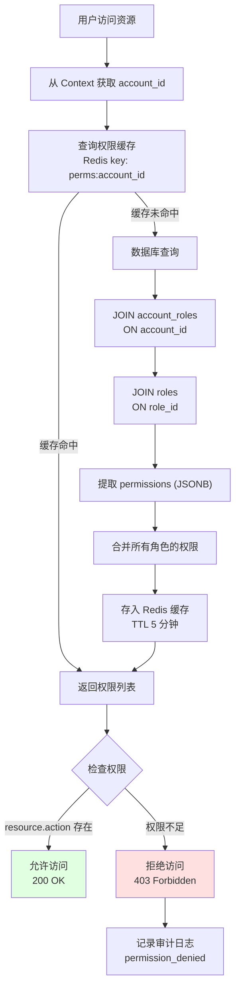

#### 📊 权限数据表设计

**permissions - 权限表**

| 字段 | 类型 | 约束 | 说明 |
|------|------|------|------|
| id | UUID | PRIMARY KEY | 权限唯一标识 |
| resource | VARCHAR(50) | NOT NULL | 资源名称 |
| action | VARCHAR(50) | NOT NULL | 操作名称 |
| description | TEXT | | 权限描述 |

- **唯一索引**: `(resource, action)`
- **示例权限**:
  - `(accounts, read)` - 查看账号
  - `(accounts, write)` - 创建/修改账号
  - `(oauth2_clients, manage)` - 管理 OAuth2 客户端
  - `(audit_logs, read)` - 查看审计日志

#### 🔗 权限分配示例

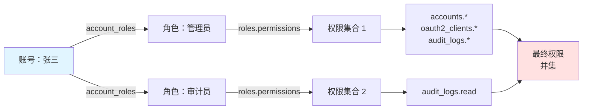

#### ✅ 实施任务清单
- [ ] 实现权限检查服务（internal/authz/service/permission_service.go）
  - 账号权限查询（基于角色，JOIN account_roles -> roles -> permissions）
  - 权限判断（account.can(resource, action)）
  - 缓存权限结果（Redis，TTL 5 分钟）
- [ ] 实现权限中间件（middleware/permission_middleware.go）
  - 装饰器模式：RequirePermission("accounts", "read")
  - 403 Forbidden 返回
  - 审计日志记录（权限拒绝事件）

**参考文档**:
- NIST RBAC Model
- Casbin 库（可选）

---

### 🔲 20. 基于策略的访问控制（可选 OPA 集成）
**知识点**: Policy as Code、Rego、属性驱动授权

- [ ] 集成 OPA（Open Policy Agent）
  - 安装 OPA sidecar 或嵌入式模式（使用 github.com/open-policy-agent/opa/rego）
- [ ] 定义策略文件（policy/authz.rego）
  - 示例：允许同部门账号访问资源
  - 基于时间、地理位置的访问控制
  - 基于账号属性（roles、groups）的授权
- [ ] 实现策略评估服务（internal/authz/service/policy_service.go）
  - 调用 OPA API 评估策略（rego.New().PrepareForEval()）
  - 上下文注入（account, resource, action, env）
  - 返回 allow/deny 决策
- [ ] 集成到授权流程
  - OAuth2 授权前策略检查（是否允许该账号访问该客户端）
  - API 访问前策略检查（替代或补充 RBAC）

**参考文档**:
- Open Policy Agent 官方文档
- Rego 语法

---

## 阶段六：管理后台与 API (第 10 周)

### 🔲 21. 账号管理 API
**知识点**: RESTful API、分页、过滤、排序

- [ ] 实现账号列表 API
  - GET /api/v1/admin/accounts
  - 分页：page, page_size
  - 过滤：email（从 account_credentials 关联查询）, status, created_after
  - 排序：sort=created_at:desc
  - 返回：accounts 信息 + 主要 email/phone 凭证
- [ ] 实现账号详情 API
  - GET /api/v1/admin/accounts/{account_id}
  - 返回：account 信息 + 所有凭证 + 角色 + 群组
- [ ] 实现账号创建 API
  - POST /api/v1/admin/accounts
  - 创建 account + 初始凭证（email/phone + password）
  - 支持批量导入（CSV/Excel）
- [ ] 实现账号更新 API
  - PUT /api/v1/admin/accounts/{account_id}（完整更新）
  - PATCH /api/v1/admin/accounts/{account_id}（部分更新）
  - 更新 display_name, avatar_url, locale, timezone 等
- [ ] 实现账号禁用/启用
  - POST /api/v1/admin/accounts/{account_id}/disable（设置 status='suspended'）
  - POST /api/v1/admin/accounts/{account_id}/enable（设置 status='active'）
  - 禁用时撤销所有有效 Token
- [ ] 实现账号角色分配
  - POST /api/v1/admin/accounts/{account_id}/roles（添加角色，插入 account_roles）
  - DELETE /api/v1/admin/accounts/{account_id}/roles/{role_id}（移除角色）
  - GET /api/v1/admin/accounts/{account_id}/roles（列出角色）

---

### 🔲 22. 客户端管理 API（已在任务 9 实现）
- [ ] API 文档完善
- [ ] 前端页面开发（可选）

---

### 🔲 23. 审计日志查询 API
**知识点**: 日志聚合、时序数据查询、复合索引优化

#### 📊 推荐索引设计

**audit_logs 表（已存在，需优化索引）**

```sql
-- 索引 1：按账号查询（最常用）
CREATE INDEX idx_audit_logs_account_time 
ON audit_logs(account_id, created_at DESC) 
WHERE account_id IS NOT NULL;

-- 索引 2：按操作类型查询
CREATE INDEX idx_audit_logs_action_time 
ON audit_logs(action, created_at DESC);

-- 索引 3：复合查询（账号 + 操作 + 时间）
CREATE INDEX idx_audit_logs_account_action_time 
ON audit_logs(account_id, action, created_at DESC) 
WHERE account_id IS NOT NULL;

-- 索引 4：仅时间范围查询
CREATE INDEX idx_audit_logs_created_at 
ON audit_logs(created_at DESC);

-- 索引 5：IP 地址查询（安全调查）
CREATE INDEX idx_audit_logs_ip 
ON audit_logs(ip_address, created_at DESC) 
WHERE ip_address IS NOT NULL;
```

**索引使用场景说明:**

| 查询场景 | 使用的索引 | 示例查询 |
|---------|-----------|---------|
| 查询某账号的所有日志 | idx_audit_logs_account_time | WHERE account_id = ? ORDER BY created_at DESC |
| 查询所有登录操作 | idx_audit_logs_action_time | WHERE action = 'login' ORDER BY created_at DESC |
| 查询某账号的登录记录 | idx_audit_logs_account_action_time | WHERE account_id = ? AND action = 'login' |
| 查询时间范围内的日志 | idx_audit_logs_created_at | WHERE created_at BETWEEN ? AND ? |
| 查询某 IP 的操作 | idx_audit_logs_ip | WHERE ip_address = ? |

#### ✅ 实施任务清单

- [ ] 实现审计日志查询 API
  - GET /api/v1/admin/audit/logs
  - 过滤：account_id, action, created_after, created_before, ip_address
  - 分页与排序（默认按 created_at DESC）
  - **性能优化**: 添加上述推荐索引
- [ ] 实现审计日志详情 API
  - GET /api/v1/admin/audit/logs/{log_id}
  - 显示完整的日志信息（metadata、IP、User-Agent 等）
- [ ] 实现审计日志导出（CSV/JSON）
  - GET /api/v1/admin/audit/logs/export?format=csv
  - 流式导出大量数据
  - 限制导出数量（如最多 10 万条）

---

### 🔲 24. 管理后台前端（可选）
**知识点**: React/Vue、Admin UI、API 集成

- [ ] 搭建前端项目（React + Ant Design / Vue + Element Plus）
- [ ] 实现登录页面（使用 SSO 本身进行认证）
- [ ] 实现账号管理页面
  - 列表、创建、编辑、禁用
  - 凭证管理（查看邮箱、手机号、MFA 状态）
- [ ] 实现客户端管理页面
  - OAuth2 客户端注册与配置
- [ ] 实现审计日志页面
  - 查询、过滤、导出
- [ ] 实现系统配置页面
  - 身份提供商配置（Google、GitHub 等）
  - 密钥管理与轮换

**参考文档**:
- Ant Design / Element Plus
- React Query / Vue Apollo

---

## 阶段七：可观测性与运维 (第 11 周)

### 🔲 25. 结构化日志与追踪
**知识点**: Structured Logging、Trace ID、Correlation ID

- [ ] 统一日志格式（JSON）
  - 已有 Zap Logger，需规范使用
  - 字段：timestamp, level, trace_id, account_id, action, message, error, duration
  - 所有日志调用统一使用 logger.With(zap.String("account_id", id))
- [ ] 实现 Trace ID 中间件
  - 生成唯一 Trace ID（UUID v4）
  - 注入到 gin.Context（c.Set("trace_id", traceID)）
  - 响应 Header 返回（X-Trace-Id）
  - 日志中包含 trace_id
- [ ] 集成 OpenTelemetry（可选）
  - 安装 go.opentelemetry.io/otel
  - Span 追踪（HTTP 请求、数据库查询、Redis 操作）
  - 导出到 Jaeger/Zipkin

**参考文档**:
- Zap Logger 最佳实践
- OpenTelemetry Go SDK

---

### 🔲 26. 监控指标与告警
**知识点**: Prometheus、Grafana、Metrics、PromQL

- [ ] 集成 Prometheus 客户端
  - 安装 prometheus/client_golang
- [ ] 实现指标收集
  - HTTP 请求数（按路径、状态码）
  - 请求延迟（Histogram）
  - 数据库连接数
  - Redis 命令执行次数
  - 登录成功/失败次数
  - Token 签发次数
- [ ] 暴露 Metrics 端点
  - GET /metrics
- [ ] 编写 Prometheus 配置（prometheus.yml）
- [ ] 导入 Grafana Dashboard
  - 系统概览
  - 认证流量监控
  - 错误率监控

**参考文档**:
- Prometheus 官方文档
- Grafana Dashboard 库

---

### 🔲 27. 健康检查与就绪探针
**知识点**: Health Check、Liveness、Readiness、Kubernetes

- [ ] 实现健康检查端点
  - GET /health
  - 返回状态：ok/degraded/down
  - 检查项：数据库连接、Redis 连接
- [ ] 实现就绪探针端点
  - GET /readiness
  - 检查服务是否准备好接收流量
- [ ] 实现存活探针端点
  - GET /liveness
  - 检查服务是否存活（简单心跳）

**参考文档**:
- Kubernetes Health Checks

---

## 阶段八：高级功能 (第 12-13 周)

### 🔲 28. 设备管理与可信设备
**知识点**: Device Fingerprinting、User-Agent、Device Token

#### 📊 数据表设计

**account_devices - 设备管理表**

| 字段 | 类型 | 约束 | 说明 |
|------|------|------|------|
| id | UUID | PRIMARY KEY | 唯一标识 |
| account_id | UUID | NOT NULL | 关联账号（应用层外键） |
| device_id | VARCHAR(255) | NOT NULL | 设备唯一标识（指纹 hash） |
| device_name | VARCHAR(100) | | 设备名称（如 "Chrome on MacOS"） |
| device_type | VARCHAR(20) | | 类型：desktop/mobile/tablet |
| os | VARCHAR(50) | | 操作系统（如 "MacOS 14.0"） |
| browser | VARCHAR(50) | | 浏览器（如 "Chrome 120"） |
| user_agent | TEXT | | 完整 User-Agent 字符串 |
| fingerprint | TEXT | | 设备指纹（IP + UA + 其他特征 hash） |
| trusted | BOOLEAN | DEFAULT false | 是否为可信设备 |
| ip_address | VARCHAR(45) | | 首次登录 IP |
| location | VARCHAR(100) | | 地理位置（如 "Beijing, China"） |
| last_used_at | TIMESTAMPTZ | | 最后使用时间 |
| created_at | TIMESTAMPTZ | DEFAULT NOW() | 首次登录时间 |
| deleted_at | TIMESTAMPTZ | NULL | **软删除时间** |

- **索引**:
  - `(account_id, device_id)` (复合唯一索引，WHERE deleted_at IS NULL)
  - `account_id` (WHERE deleted_at IS NULL)
  - `last_used_at` (用于清理长时间未使用的设备)
- **软删除策略**: 用户移除设备时软删除，保留历史记录
- **可信设备**: 标记为 `trusted=true` 的设备可降低 MFA 验证频率
- **自动清理**: 超过 180 天未使用的设备自动软删除

#### ✅ 实施任务清单

- [ ] 编写数据库迁移脚本 `db/migrations/0011_account_devices.up.sql`
- [ ] 实现设备注册与识别
  - 提取 User-Agent（使用 ua-parser-go 库解析浏览器、OS、设备类型）
  - 生成设备指纹（IP + UA + Canvas/WebGL 特征的 SHA256 hash）
  - 新设备登录时插入 account_devices 记录
  - 新设备登录通知（邮件/短信）
- [ ] 实现设备管理 API
  - GET /api/v1/user/devices（列出当前账号的所有设备）
  - DELETE /api/v1/user/devices/{device_id}（移除设备，撤销相关 Token）
  - POST /api/v1/user/devices/{device_id}/trust（标记为可信设备，降低 MFA 频率）

**参考文档**:
- FingerprintJS
- Device Detection Libraries

---

### 🔲 29. 风险评分与自适应认证
**知识点**: Risk-Based Authentication、Anomaly Detection、机器学习

- [ ] 实现风险评分引擎（internal/risk/service/risk_service.go）
  - 因素：IP 地理位置、登录时间、设备新旧、失败次数
  - 计算风险分数（0-100）
- [ ] 定义风险策略
  - 低风险（0-30）：正常登录
  - 中风险（31-70）：要求 MFA
  - 高风险（71-100）：阻止登录 + 通知用户
- [ ] 实现自适应认证流程
  - 登录时实时计算风险
  - 动态要求 MFA 或额外验证
- [ ] 实现异常登录通知
  - 邮件/短信通知用户
  - 显示登录地点、设备、时间

**参考文档**:
- Adaptive Authentication Best Practices
- Anomaly Detection Algorithms

---

### 🔲 30. Webhook 与事件系统
**知识点**: Event-Driven Architecture、Webhook、Kafka/NATS

#### 📊 数据表设计

**webhooks - Webhook 订阅表**

| 字段 | 类型 | 约束 | 说明 |
|------|------|------|------|
| id | UUID | PRIMARY KEY | 唯一标识 |
| client_id | VARCHAR(255) | NOT NULL | 关联客户端（应用层外键） |
| url | TEXT | NOT NULL | Webhook 回调 URL |
| events | JSONB | DEFAULT '[]' | 订阅的事件列表 |
| secret | VARCHAR(255) | NOT NULL | HMAC 签名密钥 |
| enabled | BOOLEAN | DEFAULT true | 是否启用 |
| failure_count | INTEGER | DEFAULT 0 | 连续失败次数 |
| last_success_at | TIMESTAMPTZ | | 最后成功时间 |
| last_failure_at | TIMESTAMPTZ | | 最后失败时间 |
| created_at | TIMESTAMPTZ | DEFAULT NOW() | 创建时间 |
| updated_at | TIMESTAMPTZ | DEFAULT NOW() | 更新时间 |
| deleted_at | TIMESTAMPTZ | NULL | **软删除时间** |

- **events 可选值**:
  - `account.created` - 账号创建
  - `account.deleted` - 账号删除
  - `account.updated` - 账号更新
  - `account.login` - 账号登录
  - `account.logout` - 账号登出
  - `token.issued` - Token 签发
  - `token.revoked` - Token 撤销
  - `mfa.enabled` - MFA 启用
  - `mfa.disabled` - MFA 禁用
- **索引**:
  - `client_id` (WHERE deleted_at IS NULL)
  - `enabled` (WHERE deleted_at IS NULL)
- **软删除策略**: 客户端删除 Webhook 时软删除
- **失败策略**: 连续失败 5 次自动禁用，管理员可重新启用

**webhook_deliveries - Webhook 投递记录表**

| 字段 | 类型 | 约束 | 说明 |
|------|------|------|------|
| id | UUID | PRIMARY KEY | 唯一标识 |
| webhook_id | UUID | NOT NULL | 关联 Webhook（应用层外键） |
| event_type | VARCHAR(50) | NOT NULL | 事件类型 |
| payload | JSONB | NOT NULL | 事件负载 |
| status | VARCHAR(20) | NOT NULL | 状态：pending/success/failed |
| http_status | INTEGER | | HTTP 响应状态码 |
| response_body | TEXT | | 响应内容（最多 1KB） |
| attempt_count | INTEGER | DEFAULT 0 | 尝试次数 |
| next_retry_at | TIMESTAMPTZ | | 下次重试时间 |
| created_at | TIMESTAMPTZ | DEFAULT NOW() | 创建时间 |
| delivered_at | TIMESTAMPTZ | | 投递成功时间 |

- **索引**:
  - `webhook_id`
  - `(status, next_retry_at)` (查找待重试的投递)
  - `created_at` (便于清理旧记录)
- **重试策略**: 指数退避，最多重试 3 次（1min, 5min, 30min）
- **清理策略**: 成功投递的记录保留 7 天，失败记录保留 30 天

#### ✅ 实施任务清单

- [ ] 编写数据库迁移脚本 `db/migrations/0012_webhooks.up.sql`
- [ ] 实现事件发布服务 `internal/event/service/publisher.go`
  - 事件类型定义
  - 事件负载构建
  - 异步发布到消息队列（可选 Redis Streams/Kafka）
- [ ] 实现 Webhook 推送服务 `internal/webhook/service/webhook_service.go`
  - HTTP POST 到客户端 URL
  - HMAC-SHA256 签名（Header: X-Webhook-Signature）
  - 超时控制（5 秒）
  - 重试机制（指数退避）
  - 失败记录和自动禁用
- [ ] 实现 Webhook 管理 API
  - POST /api/v1/oauth2/clients/{client_id}/webhooks
  - GET /api/v1/oauth2/clients/{client_id}/webhooks
  - DELETE /api/v1/oauth2/clients/{client_id}/webhooks/{webhook_id}
  - DELETE /api/v1/oauth2/clients/{client_id}/webhooks/{webhook_id}

**参考文档**:
- Webhook Best Practices
- Apache Kafka / NATS Streaming

---

### 🔲 31. SCIM Provisioning（企业功能）
**知识点**: SCIM 2.0、User Provisioning、HR 系统集成

- [ ] 实现 SCIM 2.0 Users API
  - GET /scim/v2/Users（列出账号）
  - POST /scim/v2/Users（创建账号）
  - GET /scim/v2/Users/{account_id}（获取账号）
  - PUT /scim/v2/Users/{account_id}（更新账号）
  - PATCH /scim/v2/Users/{account_id}（部分更新）
  - DELETE /scim/v2/Users/{account_id}（删除/停用账号）
  - 映射：SCIM User Schema -> accounts + account_credentials
- [ ] 实现 SCIM Groups API
  - GET /scim/v2/Groups
  - POST /scim/v2/Groups
  - GET /scim/v2/Groups/{group_id}
  - PUT /scim/v2/Groups/{group_id}
  - DELETE /scim/v2/Groups/{group_id}
  - 映射：SCIM Group Schema -> groups + account_groups
- [ ] 实现 SCIM 过滤与分页
  - Filter 语法：userName eq "john@example.com"（解析并转换为 SQL）
  - 分页参数：startIndex, count

**参考文档**:
- RFC 7643 (SCIM Core Schema)
- RFC 7644 (SCIM Protocol)

---

### 🔲 32. LDAP/AD 集成（企业功能）
**知识点**: LDAP、Active Directory、绑定认证、属性映射

- [ ] 实现 LDAP 连接服务（internal/ldap/service/ldap_service.go）
  - LDAP Bind 认证
  - 用户搜索（by DN, by filter）
  - 属性读取（mail, cn, memberOf）
- [ ] 实现 LDAP 登录
  - 用户输入域账号（user@domain.com 或 DOMAIN\user）
  - LDAP Bind 验证密码
  - 同步用户信息到本地数据库
- [ ] 实现 LDAP 用户同步定时任务
  - 定期同步用户与群组
  - 增量同步（基于 modifyTimestamp）

**参考文档**:
- go-ldap/ldap 库
- Microsoft Active Directory 协议

---

## 阶段九：测试与文档 (第 14 周)

### 🔲 33. 错误码与国际化设计
**知识点**: Error Handling、i18n、OAuth 2.0 Error Codes

#### 📊 错误码设计规范

**OAuth 2.0 标准错误码（RFC 6749）**

| 错误码 | HTTP 状态码 | 说明 | 返回场景 |
|-------|------------|------|---------|
| `invalid_request` | 400 | 请求缺少必需参数或参数无效 | 所有端点 |
| `invalid_client` | 401 | 客户端认证失败 | /oauth2/token |
| `invalid_grant` | 400 | 授权码/刷新令牌无效或过期 | /oauth2/token |
| `unauthorized_client` | 400 | 客户端无权使用此授权类型 | /oauth2/authorize |
| `unsupported_grant_type` | 400 | 不支持的授权类型 | /oauth2/token |
| `invalid_scope` | 400 | 请求的 scope 无效或超出授权 | /oauth2/authorize |
| `access_denied` | 403 | 用户拒绝授权 | /oauth2/authorize |
| `server_error` | 500 | 服务器内部错误 | 所有端点 |
| `temporarily_unavailable` | 503 | 服务暂时不可用 | 所有端点 |

**OIDC 扩展错误码**

| 错误码 | HTTP 状态码 | 说明 |
|-------|------------|------|
| `interaction_required` | 400 | 需要用户交互（如登录） |
| `login_required` | 400 | 需要用户重新登录 |
| `account_selection_required` | 400 | 需要用户选择账号 |
| `consent_required` | 400 | 需要用户同意 |

**自定义业务错误码（SSO 系统）**

| 错误码 | HTTP 状态码 | 说明 | 场景 |
|-------|------------|------|------|
| `account_not_found` | 404 | 账号不存在 | 登录 |
| `account_suspended` | 403 | 账号已被禁用 | 登录 |
| `account_deleted` | 410 | 账号已删除 | 登录 |
| `invalid_credentials` | 401 | 用户名或密码错误 | 登录 |
| `mfa_required` | 403 | 需要多因素认证 | 登录 |
| `mfa_invalid` | 401 | MFA 验证码错误 | MFA 验证 |
| `email_not_verified` | 403 | 邮箱未验证 | 敏感操作 |
| `rate_limit_exceeded` | 429 | 请求过于频繁 | 所有端点 |
| `weak_password` | 400 | 密码强度不足 | 注册/修改密码 |
| `duplicate_email` | 409 | 邮箱已被使用 | 注册 |
| `token_expired` | 401 | Token 已过期 | API 调用 |
| `token_revoked` | 401 | Token 已被撤销 | API 调用 |
| `insufficient_permissions` | 403 | 权限不足 | 所有受保护端点 |

#### 📋 错误响应格式

```json
{
  "error": "invalid_grant",
  "error_description": "Authorization code has expired",
  "error_uri": "https://docs.sso.example.com/errors#invalid_grant",
  "trace_id": "550e8400-e29b-41d4-a716-446655440000",
  "timestamp": "2024-12-31T10:30:00Z"
}
```

#### 🌐 国际化支持（可选）

```json
{
  "error": "invalid_credentials",
  "error_description": "用户名或密码错误",
  "error_description_en": "Invalid username or password",
  "error_uri": "https://docs.sso.example.com/zh/errors#invalid_credentials"
}
```

#### ✅ 实施任务清单

- [ ] 定义错误码常量 `internal/errors/codes.go`
  - OAuth 2.0 标准错误码
  - OIDC 错误码
  - 自定义业务错误码
- [ ] 实现统一错误处理中间件 `middleware/error_handler.go`
  - 捕获 panic 并转换为 500 错误
  - 统一错误响应格式
  - 记录错误日志（包含 trace_id）
- [ ] 实现错误响应构造器 `internal/errors/response.go`
  - NewOAuthError()
  - NewBusinessError()
  - 支持国际化（从 Accept-Language Header 读取语言）
- [ ] 编写错误码文档 `doc/error-codes.md`
  - 所有错误码列表
  - 错误处理最佳实践
  - 示例代码

---

### 🔲 34. 单元测试
**知识点**: Go Testing、Testify、Mock、Table-Driven Tests

- [ ] 编写核心服务单元测试
  - User Service 测试
  - JWT Service 测试
  - OAuth2 Service 测试
  - Permission Service 测试
- [ ] 编写仓储层测试（使用 Test Database）
- [ ] Mock 外部依赖（Redis、SMTP、第三方 API）
- [ ] 达到 70%+ 代码覆盖率

**参考文档**:
- Go Testing Package
- Testify 库
- golang/mock

---

### 🔲 34. 集成测试
**知识点**: E2E Testing、Testcontainers、HTTP Test

- [ ] 使用 Testcontainers 启动测试环境
  - PostgreSQL 容器
  - Redis 容器
- [ ] 编写完整流程集成测试
  - 用户注册 -> 登录 -> 获取 Token -> 访问受保护资源
  - OAuth2 授权码流程完整测试
  - Refresh Token 轮换测试
- [ ] 编写安全测试
  - PKCE 缺失测试
  - Redirect URI 劫持测试
  - CSRF 攻击测试

**参考文档**:
- Testcontainers for Go
- httptest Package

---

### 🔲 35. 性能测试与基准测试
**知识点**: Benchmark、压力测试、性能分析、pprof

#### 🎯 性能指标目标

| 指标 | 目标值 | 测试场景 |
|------|-------|---------|
| 登录 API QPS | > 5000 | 并发登录 |
| Token 签发延迟 | < 50ms | P99 延迟 |
| Token 验证延迟 | < 10ms | P99 延迟 |
| 数据库查询延迟 | < 20ms | 单条记录查询 |
| Redis 操作延迟 | < 5ms | GET/SET 操作 |
| API 可用性 | > 99.9% | 24/7 运行 |

#### ✅ 实施任务清单

- [ ] 编写性能基准测试 `tests/benchmark_test.go`
  - JWT 签发/验证性能
  - 密码哈希性能（bcrypt vs argon2）
  - 数据库查询性能
  - Redis 操作性能
  - 使用 `go test -bench=. -benchmem` 运行
- [ ] 实施压力测试
  - 工具选择：wrk / k6 / Apache Bench
  - 测试场景：
    - 登录流程（POST /api/v1/auth/login）
    - OAuth2 授权码流程
    - Token 刷新流程
    - UserInfo 端点（GET /oauth2/userinfo）
  - 压测脚本示例：
    ```bash
    # 使用 wrk 测试登录 API
    wrk -t12 -c400 -d30s --latency \
      -s scripts/login.lua \
      http://localhost:8080/api/v1/auth/login
    ```
- [ ] 性能分析与优化
  - 使用 pprof 分析 CPU/内存瓶颈
  - 火焰图生成（go tool pprof）
  - 识别热点代码路径
  - 数据库慢查询分析（EXPLAIN ANALYZE）
  - Redis 慢日志分析
- [ ] 编写性能测试报告 `doc/performance-report.md`
  - 测试环境说明
  - 性能指标结果
  - 瓶颈分析
  - 优化建议

**参考文档**:
- Go Benchmarking
- wrk / k6 工具文档
- pprof 使用指南

---

### 🔲 36. API 文档
**知识点**: OpenAPI 3.0、Swagger、Redoc

- [ ] 使用 Swagger 注解生成 OpenAPI 文档
  - 安装 swaggo/swag
  - 在 Handler 中添加注解
- [ ] 生成 OpenAPI 3.0 规范文件（openapi.yaml）
- [ ] 部署 Swagger UI
  - GET /swagger/index.html
- [ ] 编写 API 使用指南（doc/api-guide.md）
  - 认证流程说明
  - 示例代码（curl、Python、JavaScript）

**参考文档**:
- swaggo/swag
- OpenAPI 3.0 Specification

---

### 🔲 36. 开发者文档
**知识点**: Markdown、架构设计、部署指南

- [ ] 编写系统架构文档（doc/architecture.md）
  - 整体架构图（用 Mermaid）
  - 模块划分
  - 数据流图
- [ ] 编写部署指南（doc/deployment.md）
  - Docker Compose 部署
  - Kubernetes 部署（Helm Chart）
  - 环境变量配置
- [ ] 编写运维手册（doc/operations.md）
  - 密钥轮换操作
  - 数据库备份与恢复
  - 日志查询与故障排查
- [ ] 编写贡献指南（CONTRIBUTING.md）

---

## 阶段十：部署与优化 (第 15 周)

### 🔲 38. Docker 化
**知识点**: Dockerfile、Multi-Stage Build、容器优化

- [ ] 编写 Dockerfile
  - Multi-stage build（编译 + 运行）
  - 使用 Alpine/Distroless 镜像
- [ ] 优化 Docker 镜像大小
  - 删除调试符号
  - 使用 .dockerignore
- [ ] 编写 docker-compose.yml（已有，需完善）
  - SSO 服务
  - PostgreSQL
  - Redis
  - Prometheus
  - Grafana

---

### 🔲 38. Kubernetes 部署
**知识点**: Kubernetes、Helm、ConfigMap、Secret、Ingress

#### ☸️ Kubernetes 部署架构

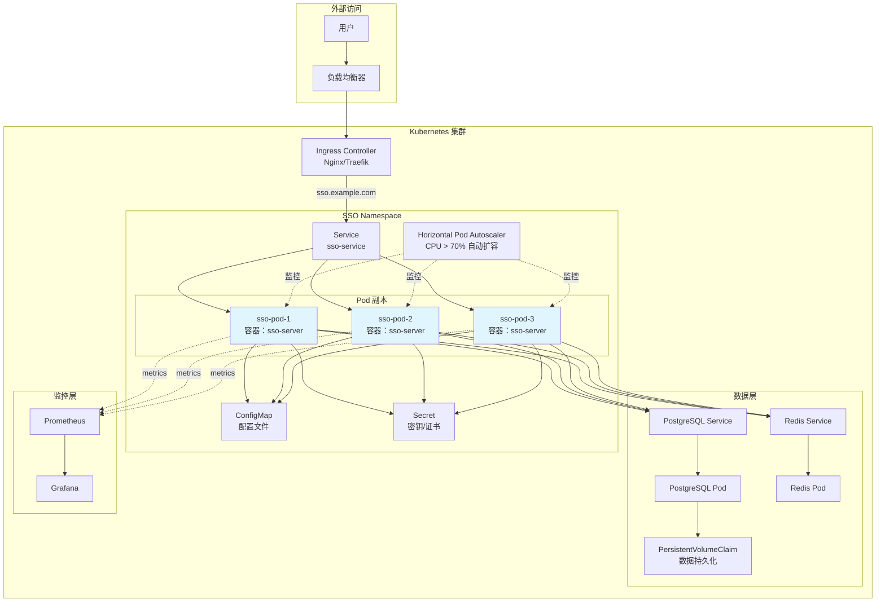

#### 📋 Kubernetes 资源清单

| 资源类型 | 名称 | 说明 |
|----------|------|------|
| Deployment | `sso-deployment` | SSO 服务部署（3 副本） |
| Service | `sso-service` | ClusterIP 类型，端口 8080 |
| Ingress | `sso-ingress` | 域名：sso.example.com，TLS 证书 |
| ConfigMap | `sso-config` | 应用配置文件（config.yaml） |
| Secret | `sso-secrets` | 敏感信息（DB 密码、密钥） |
| HPA | `sso-hpa` | CPU 阈值 70%，副本 3-10 |
| PVC | `postgres-pvc` | 存储大小 50Gi |

#### ✅ 实施任务清单

- [ ] 编写 Kubernetes Manifests
  - Deployment
  - Service
  - ConfigMap（配置文件）
  - Secret（密钥）
  - Ingress（域名与 TLS）
  - HPA（水平自动扩展）
- [ ] 编写 Helm Chart（可选）
  - templates/
  - values.yaml
  - Chart.yaml
- [ ] 配置健康检查
  - livenessProbe
  - readinessProbe
- [ ] 配置存储
  - PersistentVolumeClaim（PostgreSQL 数据）

**参考文档**:
- Kubernetes 官方文档
- Helm 官方文档

---

### 🔲 40. 性能优化
**知识点**: Profiling、缓存策略、数据库优化

- [ ] 使用 pprof 分析性能瓶颈
  - CPU Profiling
  - Memory Profiling
- [ ] 优化数据库查询
  - 添加索引
  - 查询优化（EXPLAIN ANALYZE）
  - 使用连接池
- [ ] 优化 Redis 使用
  - Pipeline 批量操作
  - 缓存热点数据（用户信息、客户端配置）
- [ ] 实现缓存预热
  - 启动时加载常用数据到 Redis
- [ ] 实现响应压缩
  - Gzip 中间件

**参考文档**:
- Go Profiling Best Practices
- PostgreSQL Performance Tuning

---

### 🔲 41. 安全加固与审计
**知识点**: Security Hardening、Penetration Testing、OWASP

- [ ] 安全配置检查
  - HTTPS 强制（生产环境）
  - TLS 1.2+ 版本
  - 强加密套件
- [ ] 密钥管理审计
  - 私钥权限检查（600）
  - 密钥加密存储（可选 KMS）
- [ ] 代码安全审计
  - gosec 静态分析
  - 依赖漏洞扫描（snyk/trivy）
- [ ] 渗透测试（可选）
  - 使用 OWASP ZAP / Burp Suite
  - 测试 XSS、SQL 注入、CSRF、认证绕过

**参考文档**:
- OWASP ASVS (Application Security Verification Standard)
- CIS Benchmarks

---

## 附录：持续迭代

### 未来功能扩展
- [ ] 生物识别认证（WebAuthn / FIDO2）
- [ ] 无密码登录（Magic Link）
- [ ] 多租户支持（SaaS 模式）
- [ ] 国际化（i18n）支持
- [ ] 前端 SDK（JavaScript、React、Vue）
- [ ] 移动端 SDK（iOS、Android）
- [ ] 支持 SAML 2.0 协议
- [ ] 支持 WS-Federation 协议
- [ ] AI 驱动的异常检测

---

## 每日工作建议

### 工作节奏
- **每天聚焦 1-2 个任务**，完成后再进入下一个
- **每周五回顾**：代码审查、测试覆盖、文档更新
- **每两周演示**：展示已完成功能，收集反馈

### 学习路径
1. **第 1 周**：熟悉 OAuth 2.0/OIDC 协议，阅读 RFC 文档
2. **第 2-3 周**：深入 JWT、密钥管理、PKCE
3. **第 4-5 周**：实战 OAuth 2.0 流程实现
4. **第 6-7 周**：学习 OIDC、会话管理、登出
5. **第 8 周**：安全最佳实践、OWASP Top 10
6. **第 9 周**：权限模型、RBAC/ABAC
7. **第 10-11 周**：运维工具、监控、日志
8. **第 12-13 周**：高级功能、企业集成
9. **第 14 周**：测试与质量保证
10. **第 15 周**：部署与上线

---

## 资源与参考

### 必读规范
- [RFC 6749 - OAuth 2.0](https://tools.ietf.org/html/rfc6749)
- [OAuth 2.1 Draft](https://datatracker.ietf.org/doc/html/draft-ietf-oauth-v2-1-07)
- [RFC 7636 - PKCE](https://tools.ietf.org/html/rfc7636)
- [OpenID Connect Core 1.0](https://openid.net/specs/openid-connect-core-1_0.html)
- [RFC 7519 - JWT](https://tools.ietf.org/html/rfc7519)
- [RFC 7517 - JWK](https://tools.ietf.org/html/rfc7517)

### 推荐书籍
- *OAuth 2 in Action* by Justin Richer
- *Solving Identity Management in Modern Applications* by Yvonne Wilson & Abhishek Hingnikar

### 开源项目参考
- [ORY Hydra](https://github.com/ory/hydra) - Go OAuth 2.0 / OIDC Server
- [Keycloak](https://www.keycloak.org/) - Java SSO 解决方案
- [Authelia](https://github.com/authelia/authelia) - Go 认证服务器
- [Casdoor](https://github.com/casdoor/casdoor) - Go SSO 平台

### 社区与工具
- [jwt.io](https://jwt.io/) - JWT Debugger
- [OAuth.tools](https://oauth.tools/) - OAuth 测试工具
- [OWASP Cheat Sheet Series](https://cheatsheetseries.owasp.org/)

---

**祝开发顺利！记住：安全第一，质量优先，持续迭代。**
