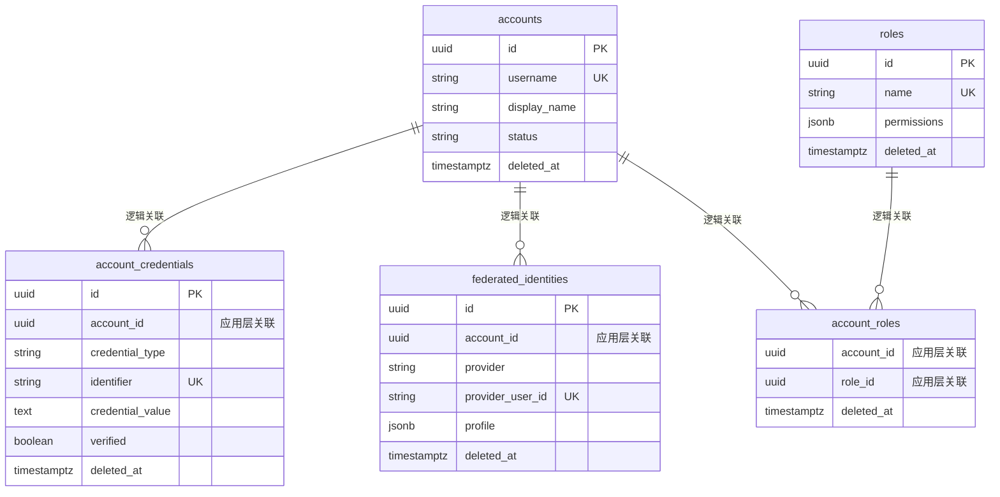

# 任务 2 - 数据库设计与账号基础模块 - 快速入门

## ✅ 任务完成情况

| 子任务 | 状态 | 说明 |
|--------|------|------|
| 数据库迁移脚本 | ✅ | `db/migrations/0002_accounts.{up,down}.sql` |
| Domain 层 | ✅ | 4 个实体模型 |
| Repository 层 | ✅ | 4 个仓储接口和实现 |
| Service 层 | ✅ | 账号服务完整实现 |
| 数据库工具 | ✅ | 事务辅助方法 |
| 单元测试 | ✅ | Service 层测试 |
| 示例代码 | ✅ | 完整使用示例 |
| 文档 | ✅ | 模块 README |

## 📂 生成的文件清单

### 数据库层
```
db/migrations/
├── 0002_accounts.up.sql       # 创建表、索引、触发器
└── 0002_accounts.down.sql     # 回滚脚本
```

### Domain 层（领域模型）
```
internal/account/domain/
├── account.go                  # 账号实体
├── credential.go               # 凭证实体
├── federated_identity.go       # 第三方身份实体
└── role.go                     # 角色实体
```

### Repository 层（数据访问）
```
internal/account/repository/
├── account_repository.go              # 账号仓储
├── credential_repository.go           # 凭证仓储
├── federated_identity_repository.go   # 第三方身份仓储
└── role_repository.go                 # 角色仓储
```

### Service 层（业务逻辑）
```
internal/account/service/
├── account_service.go          # 账号服务实现
└── account_service_test.go     # 单元测试
```

### 基础设施层
```
internal/db/
├── db.go                       # 数据库连接
└── transaction.go              # 事务辅助方法

internal/account/
└── wire.go                     # 依赖注入
```

### 示例和文档
```
examples/
└── account_example.go          # 使用示例

internal/account/
└── README.md                   # 模块文档

doc/
└── task-02-quickstart.md       # 本文档
```

## 🚀 快速开始

### 1. 运行数据库迁移

```bash
# 启动 PostgreSQL（如果尚未启动）
docker-compose up -d postgres

# 运行迁移
psql -U postgres -d gosso -f db/migrations/0002_accounts.up.sql
```

### 2. 测试编译

```bash
# 下载依赖
go mod tidy

# 编译项目
go build -o bin/gosso ./cmd/main.go

# 运行测试
cd internal/account/service
go test -v
```

### 3. 使用示例

```go
package main

import (
    "context"
    "log"

    "github.com/rushairer/gosso/internal/account"
    "github.com/rushairer/gosso/internal/account/service"
    "github.com/rushairer/gosso/internal/db"
)

func main() {
    // 1. 连接数据库
    dbConfig := &db.Config{
        Host:     "localhost",
        Port:     5432,
        User:     "postgres",
        Password: "password",
        Database: "gosso",
        SSLMode:  "disable",
    }
    
    database, err := db.Connect(dbConfig)
    if err != nil {
        log.Fatal(err)
    }
    defer database.Close()
    
    // 2. 初始化账号服务
    accountService := account.InitializeAccountModule(database.DB)
    
    // 3. 注册新账号
    req := &service.RegisterAccountRequest{
        Username:    "alice",
        DisplayName: "Alice Smith",
        Email:       "alice@example.com",
        Password:    "SecurePassword123!",
        Locale:      "en",
        Timezone:    "UTC",
    }
    
    account, err := accountService.RegisterAccount(context.Background(), req)
    if err != nil {
        log.Fatal(err)
    }
    
    log.Printf("✅ 注册成功: %s (%s)", account.DisplayName, account.ID)
}
```

## 🏗️ 架构设计亮点

### 1. 严格的三层架构

```
Service 层 → Repository 层 → Database
(业务逻辑)   (数据访问)      (持久化)
```

- **Service 层**：负责事务管理、业务逻辑编排、业务验证
- **Repository 层**：封装所有 SQL 操作，接收 `*sql.Tx` 参数
- **Domain 层**：纯粹的领域模型，不依赖任何基础设施

### 2. 事务处理范式

✅ **正确**：Service 层管理事务
```go
func (s *accountServiceImpl) RegisterAccount(ctx context.Context, req *RegisterAccountRequest) error {
    tx, _ := s.db.BeginTx(ctx, &sql.TxOptions{...})
    defer tx.Rollback()
    
    s.accountRepo.CreateAccount(ctx, tx, account)
    s.credentialRepo.CreateCredential(ctx, tx, credential)
    
    return tx.Commit()
}
```

❌ **错误**：Repository 层管理事务（违反单一职责）
```go
func (r *accountRepositoryImpl) CreateAccount(...) error {
    tx, _ := r.db.BeginTx(...) // ❌ 不应该在这里管理事务
}
```

### 3. 软删除策略

- 所有表都有 `deleted_at` 字段
- 使用部分索引：`WHERE deleted_at IS NULL`
- 保留完整的审计追踪
- 支持数据恢复

### 4. 无外键约束

- 不使用数据库外键（高并发性能优先）
- 应用层保证引用完整性
- 所有关联操作在事务中执行

### 5. 密码安全

- 使用 bcrypt 哈希（cost=10）
- 不存储明文密码
- 支持密码强度验证

## 🧪 测试指南

### 单元测试

```bash
cd internal/account/service
go test -v

# 查看测试覆盖率
go test -cover
```

### 集成测试（TODO）

```bash
# 使用 Testcontainers
go test -tags=integration ./...
```

## 📊 数据库表关系

> **⚠️ 重要说明**：本项目**不使用数据库外键约束**（无 FOREIGN KEY），使用应用层保证数据一致性。
> 下图中的关系线仅表示**逻辑关联关系**，非物理外键。



**架构决策说明**：

| 维度 | 数据库外键 | 应用层约束（本项目） |
|------|------------|---------------------|
| 性能 | ❌ 外键验证开销大 | ✅ 无额外验证开销 |
| 并发 | ❌ 频繁加锁 | ✅ 无锁竞争 |
| 扩展性 | ❌ 无法跨库 | ✅ 支持分库分表 |
| 灵活性 | ❌ Schema 修改困难 | ✅ 灵活调整 |
| 数据一致性 | ✅ 数据库保证 | ✅ 事务 + 业务逻辑保证 |

**实施方式**：
- ✅ 所有修改操作在事务中执行
- ✅ Service 层保证关联数据的完整性
- ✅ 软删除级联操作由应用层处理

## 🔐 安全特性

| 特性 | 实现方式 | 说明 |
|------|----------|------|
| 密码安全 | bcrypt hash | cost=10，不存储明文 |
| 软删除 | deleted_at 字段 | 保留审计追踪 |
| 事务保证 | ACID 特性 | 隔离级别：Read Committed |
| 凭证验证 | verified 字段 | 邮箱/手机验证状态 |
| 并发控制 | updated_at 乐观锁 | 避免脏写 |

## 📈 性能优化

### 1. 索引策略
- 使用部分索引：`WHERE deleted_at IS NULL`
- 避免索引膨胀
- 合理使用复合索引

### 2. 连接池配置
```go
db.SetMaxOpenConns(25)
db.SetMaxIdleConns(5)
db.SetConnMaxLifetime(5 * time.Minute)
```

### 3. 查询优化
- 避免 N+1 查询
- 使用 JOIN 减少查询次数
- 合理使用 LIMIT

## 🔄 下一步工作

基于任务 2 的完成，后续可以继续开发：

1. **任务 3**: 密钥管理与 JWT 生成
2. **任务 4**: HTTP 路由与错误处理
3. **任务 5**: 会话管理（Redis）
4. **任务 6**: 本地登录认证
5. **任务 7**: 凭证验证（邮件/短信）

## 📚 参考资料

- [PostgreSQL 官方文档](https://www.postgresql.org/docs/)
- [Go database/sql 教程](https://go.dev/doc/database/sql-injection)
- [DDD 架构模式](https://martinfowler.com/bliki/DomainDrivenDesign.html)
- [事务处理最佳实践](../../doc/transaction-guide.md)

## 🤝 贡献指南

如发现问题或有改进建议，请：
1. 提交 Issue
2. 创建 Pull Request
3. 联系维护团队

## ✨ 完成标志

✅ **任务 2 - 数据库设计与账号基础模块已完成！**

- 所有代码编译通过
- 遵循最佳实践
- 完整的文档和示例
- 可以作为后续开发的基础

---

**下一步**: 开始实现任务 3 - 密钥管理与 JWT 生成 🚀
